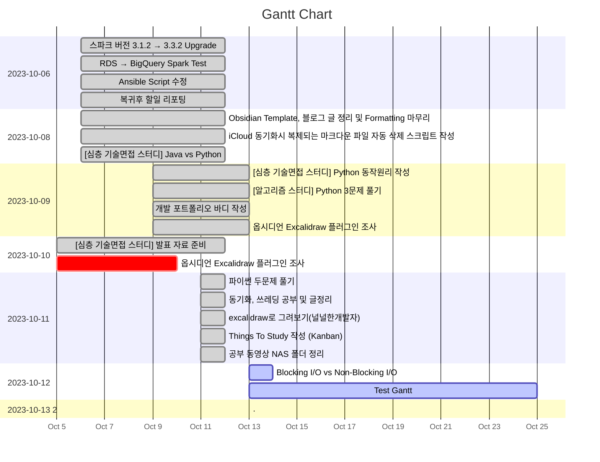

---
tags:
  - dailies
showDone: true
---
<< [[<% tp.date.now("YYYY-MM-DD", -1) %>|Yesterday]] | [[<% tp.date.now("YYYY-MM-DD", +1) %>|Tomorrow]] | [[<% tp.date.now("YYYY-MM-DD", -2) %>|그저께]] | [[<% tp.date.now("YYYY-MM-DD", +2) %>|모레]] >>

 <% tp.user.mysc() %> 

> [!warning]+ [[Action Dashboard| OverDue ]]
> ```tasks
> not done
> sort by due date
> due before <% tp.date.now() %>
> hide due date
> hide backlink
> limit 5
> ```

> [!todo]+ Today's Tasks
> ```tasks
> not done
> due <% tp.date.now() %>
> sort by path
> sort by priority
> hide due date
> hide backlink
> limit 5
> ```

> [!todo]+ Upcoming Tasks
> ```tasks  
> not done  
> due after <% tp.date.now() %>
> sort by due date
> sort by priority  





---

# To Do.

#### 오전
- [ ] 🛫 <% tp.date.now("YYYY-MM-DD") %> 📅 <% tp.date.now("YYYY-MM-DD", +1) %>
- [ ] 🛫 <% tp.date.now("YYYY-MM-DD") %> 📅 <% tp.date.now("YYYY-MM-DD", +1) %>


#### 오후
- [ ] 🛫 <% tp.date.now("YYYY-MM-DD") %> 📅 <% tp.date.now("YYYY-MM-DD", +1) %>
- [ ] 🛫 <% tp.date.now("YYYY-MM-DD") %> 📅 <% tp.date.now("YYYY-MM-DD", +1) %>


---


# 고민중
- 


---

# More Works To Be Done.


