```mermaid
gantt
        title Gantt Chart
        dateFormat  YYYY-MM-DD
        axisFormat %b %e
        section 2023-10-06

스파크 버전 3.1.2 → 3.3.2 Upgrade     :done, 2023-10-06 , 2023-10-12

RDS → BigQuery Spark Test     :done, 2023-10-06 , 2023-10-12

Ansible Script 수정     :done, 2023-10-06 , 2023-10-12

복귀후 할일 리포팅     :done, 2023-10-06 , 2023-10-12

section 2023-10-08

Obsidian Template, 블로그 글 정리 및 Formatting 마무리     :done, 2023-10-06 , 2023-10-12

iCloud 동기화시 복제되는 마크다운 파일 자동 삭제 스크립트 작성     :done, 2023-10-06 , 2023-10-12

[심층 기술면접 스터디] Java vs Python     :done, 2023-10-06 , 2023-10-12

section 2023-10-09

[심층 기술면접 스터디] Python 동작원리 작성     :done, 2023-10-09 , 2023-10-13

[알고리즘 스터디] Python 3문제 풀기     :done, 2023-10-09 , 2023-10-13

개발 포트폴리오 바디 작성     :done, 2023-10-09 , 2023-10-13

옵시디언 Excalidraw 플러그인 조사     :done, 2023-10-09 , 2023-10-13

section 2023-10-10

[심층 기술면접 스터디] 발표 자료 준비     :done, 2023-10-05 , 2023-10-12

옵시디언 Excalidraw 플러그인 조사     :crit, 2023-10-05 , 2023-10-10

section 2023-10-11

파이썬 두문제 풀기     :done, 2023-10-11 , 2023-10-12

동기화, 쓰레딩 공부 및 글정리     :done, 2023-10-11 , 2023-10-12

excalidraw로 그려보기(널널한개발자)     :done, 2023-10-11 , 2023-10-12

Things To Study 작성 (Kanban)     :done, 2023-10-11 , 2023-10-12

공부 동영상 NAS 폴더 정리     :done, 2023-10-11 , 2023-10-12

section 2023-10-12

Blocking I/O vs Non-Blocking I/O     :active, 2023-10-13, 2023-10-14

Test Gantt     :active, 2023-10-13, 2023-10-25

section 2023-10-13 2

. :active, 2023-10-13, 2023-10-13


```

---
tags:
  - dailies
showDone: true
---
<< [[<% tp.date.now("YYYY-MM-DD", -1) %>|Yesterday]] | [[<% tp.date.now("YYYY-MM-DD", +1) %>|Tomorrow]] | [[<% tp.date.now("YYYY-MM-DD", -2) %>|그저께]] | [[<% tp.date.now("YYYY-MM-DD", +2) %>|모레]] >>

 <% tp.user.mysc() %> 

> [!warning]+ [[Action Dashboard| OverDue ]]
> ```tasks
> not done
> sort by due date
> due before <% tp.date.now() %>
> hide due date
> hide backlink
> limit 5
> ```

> [!todo]+ Today's Tasks
> ```tasks
> not done
> due <% tp.date.now() %>
> sort by path
> sort by priority
> hide due date
> hide backlink
> limit 5
> ```

> [!todo]+ Upcoming Tasks
> ```tasks  
> not done  
> due after <% tp.date.now() %>
> sort by due date
> sort by priority  





---

# To Do.

#### 오전
- [ ] 🛫 <% tp.date.now("YYYY-MM-DD") %> 📅 <% tp.date.now("YYYY-MM-DD", +1) %>
- [ ] 🛫 <% tp.date.now("YYYY-MM-DD") %> 📅 <% tp.date.now("YYYY-MM-DD", +1) %>


#### 오후
- [ ] 🛫 <% tp.date.now("YYYY-MM-DD") %> 📅 <% tp.date.now("YYYY-MM-DD", +1) %>
- [ ] 🛫 <% tp.date.now("YYYY-MM-DD") %> 📅 <% tp.date.now("YYYY-MM-DD", +1) %>


---


# 고민중
- 


---

# More Works To Be Done.


