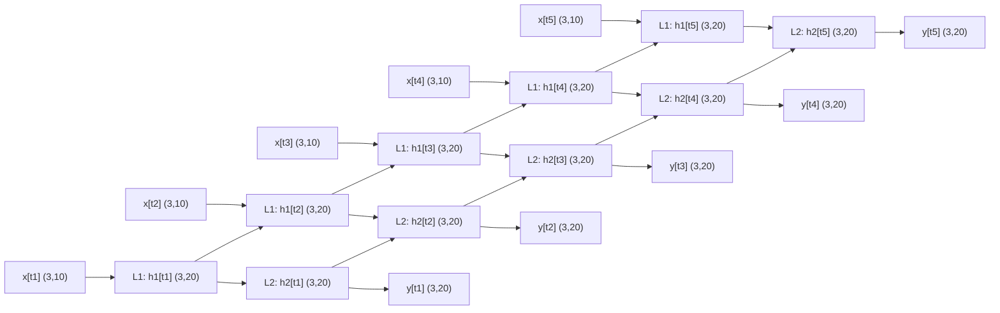

# Concepts

## Skeleton
- initialization: 입력, 은닉, 출력노드의 수 설정
- training: 학습 데이터들을 통해 학습하고 이에 따라 가중치 업데이트
- query: 입력을 받아 연산한 후 출력 노드에서 답을전달

```python
class NeuralNetwork:
  def __init__():
    pass

  def train():
    pass

  def query():
    pass
```

### KeyPoints
I = Input
O = Output
X = 입력값 (가중합) 예시) Xhidden은 은닉층 전체 노드들의 입력값 벡터
W = Weight

Xavier Init(https://huangdi.tistory.com/8)


## Init
```python
class NeuralNetwork:
  def __init__(self, inputnodes, hiddennodes, outputnodes, lr):
    self.inodes = inputnodes
    self.hnodes = hiddennodes
    self.onodes = outputnodes
    self.lr = lr
    
nn = NeuralNetwork(3, 3, 3, 0.3)
```

## Weight & Bias
```python
# Weights
self.wih = np.random.normal(0.0, pow(self.inodes, -0.5), (self.hnodes, self.inodes))

self.who = np.random.normal(0.0, pow(self.hnodes, -0.5), (self.onodes, self.hnodes))
```

### pow(self.inodes, -0.5)
`pow(self.inodes, -0.5)` =
$$\frac{1}{\sqrt{\text{입력노드 수}}}$$​
즉, 입력 노드 수가 많아질수록 가중치의 **분산(크기)** 를 줄여주는 역할을 한다.

왜?
반대로 너무 작으면 → 값이 0 근처에서만 움직여서 신호가 약해짐.

만약 입력 노드가 1000개인데, 가중치를 그냥 큰 값으로 주면,
→ 은닉층에 들어가는 값이 너무 커짐. 
→ 시그모이드 같은 활성화 함수는 **포화(saturation)** 되어 학습이 안 됨.

그래서 **1/√입력수**로 조정하면 “입력 수가 많아져도 출력 분산이 일정하게 유지”된다. 

이게 바로 **Xavier 초기화**의 기본 아이디어.


### 왜 정규분포(random.normal)로 초기화할까?
- 가중치를 전부 0이나 같은 값으로 시작하면, 모든 은닉 노드가 똑같은 계산을 해서 **대칭 깨기(symmetry breaking)** 가 안 된다 → 학습 불가능.
- 정규분포에서 **랜덤**으로 뽑아주면, 노드마다 조금씩 다른 출발점을 가지게 되어 학습이 제대로 된다.
    

👉 굳이 정규분포냐?
- 보통 `정규분포`(평균=0, 표준편차=1/√n)나 `균등분포`(−1/√n ~ 1/√n) 둘 다 씀.
- 여기서는 `정규분포`를 택했을 뿐.


## Query
- 신경망으로 들어오는 입력을 받아 출력을 반환
	- 신경망 입력 -> 은닉층 노드 입력 -> 은닉층 노드 출력 -> 최종 노드 입력 -> 최종 노드 출력
- 은닉노드와 출력 노드로 전달될때 활성화 함수 필요
```python
  def query(self, inputs_list):

    inputs = np.array(inputs_list, ndmin=2).T
    hidden_inputs = np.dot(self.wih, inputs)
    hidden_outputs = self.activation_function(hidden_inputs)

    final_inputs = np.dot(self.who, hidden_outputs)
    final_outputs = self.activation_function(final_inputs)

    return final_outputs
```

### 열 벡터
- `inputs_list`를 `np.array`로 만들되 최소 2D 보장(`ndmin=2`), 그리고 전치(`.T`)해서 **열벡터**로 만든다.
- **크기:** `(inodes, 1)`
- 왜? 가중치 행렬과의 행렬곱이 맞아떨어지게 하려면 입력이 열벡터여야 한다.
```python
inputs = np.array(inputs_list, ndmin=2).T
```

### 입력→은닉 선형결합
- `self.wih`는 `(hnodes, inodes)`
- `(hnodes, inodes) @ (inodes, 1) → (hnodes, 1)`
- **의미:** 각 은닉노드에 들어가는 가중합
```python
hidden_inputs = np.dot(self.wih, inputs)
```

$$\mathbf{h}_{in}​.$$
### 은닉 활성화
- 보통 `sigmoid`/`tanh`/`ReLU` 중 하나.
- **크기:** `(hnodes, 1)` (원소별 적용)
- **의미:** 비선형성 부여. 표현력↑, 포화/기울기 손실은 선택한 함수에 따라 다름.
```python
hidden_outputs = self.activation_function(hidden_inputs)
```


## Train
```python
  def train(self, inputs_list, targets_list):
    inputs = np.array(inputs_list, ndmin=2).T
    targets = np.array(targets_list, ndmin=2).T

    hidden_inputs = np.dot(self.wih, inputs)
    hidden_outputs = self.activation_function(hidden_inputs)

    final_inputs = np.dot(self.who, hidden_outputs)
    final_outputs = self.activation_function(final_inputs)

    output_errors = targets - final_outputs
    hidden_errors = np.dot(self.who.T, output_errors)

    self.who += self.lr * np.dot((
        output_errors * final_outputs * (1.0 - final_outputs)), np.transpose(hidden_outputs))
    self.wih += self.lr * np.dot((
        hidden_errors * hidden_outputs * (1.0 - hidden_outputs)), np.transpose(inputs))
```

### 순전파 (forward propagation)
- `wih @ inputs` → 은닉층 입력 (크기 `(hnodes, 1)`)
- 활성화 함수 통과 → 은닉층 출력 `(hnodes, 1)`
- `who @ hidden_outputs` → 출력층 입력 `(onodes, 1)`
- 활성화 함수 통과 → 최종 출력 `(onodes, 1)`
```python
hidden_inputs = np.dot(self.wih, inputs)
hidden_outputs = self.activation_function(hidden_inputs)

final_inputs = np.dot(self.who, hidden_outputs)
final_outputs = self.activation_function(final_inputs)
```

### 출력 오차 계산
- **출력층 오차** = 목표값 − 실제 출력값
- 크기: `(onodes, 1)`
```python
output_errors = targets - final_outputs
```

### 은닉층 오차 계산
출력층 오차를 은닉층으로 역전파.
who.T는 (hnodes, onodes), output_errors는 (onodes, 1) → 결과 (hnodes, 1)
의미: 은닉층의 각 노드가 출력 오차에 얼마나 기여했는지 계산.
```python
hidden_errors = np.dot(self.who.T, output_errors)
```

### 가중치 업데이트 (경사하강법)
- **출력층 가중치 업데이트**
- `output_errors * final_outputs * (1 - final_outputs)`
    - 시그모이드의 미분: $$f′(y)=y(1−y)f'(y) = y (1 - y)f′(y)=y(1−y). $$
    - 즉, **델타(δ)** = 오차 × 활성화 미분.
- 그 델타를 은닉층 출력에 곱해 경사(gradient) 계산.
- `np.dot(δ, hidden_outputs.T)` → `(onodes, hnodes)`
- 학습률 `lr`을 곱해 가중치 업데이트.
```python
self.who += self.lr * np.dot((
    output_errors * final_outputs * (1.0 - final_outputs)), np.transpose(hidden_outputs))
```

### 정리
```python
입력 x → [Wih] → 은닉 h → [Who] → 출력 y
        ↑                   ↓
     δh (hidden error)   δo (output error)

가중치 업데이트:
Wih += Wih + lr * δh * x^T
Who += Who + lr * δo * h^T
```


# 실습
## Layers


```python
# in_features: 입력 특성(또는 차원)의 수입니다.
# out_features: 출력 특성(또는 차원)의 수입니다.
# bias: 편향을 사용할지 여부를 결정하는 부울 값입니다. 기본값은 True이며, 이 경우 학습 가능한 편향이 추가됩니다.

linear_layer = nn.Linear(in_features=10, out_features=5, bias=True)

# 임의의 데이터 생성
# 예시를 위해 배치 크기가 1, 입력 특성의 개수가 10인 텐서 생성
input_tensor = torch.randn(1, 10)

# 생성한 Linear 레이어에 입력 데이터를 전달하여 출력 데이터를 얻음
output_tensor = linear_layer(input_tensor)

print('입력 층:', input_tensor.size())
print('출력 층:', output_tensor.size())
print('출력 결과: ', output_tensor)

입력 층: torch.Size([1, 10])
출력 층: torch.Size([1, 5])
출력 결과:  tensor([[ 0.7064, -0.2442,  0.1907,  0.1106,  0.1371]],
       grad_fn=<AddmmBackward0>)
```

### 예시: CNN
아래와 같은 조건으로 2차원 컨볼루션 레이어(Convolution Layers)을 생성해 봅시다.
- 입력 채널의 수: 3
- 출력 채널의 수: 16
- 커널 사이즈: 3
- 스트라이드: 1
- 패딩: 0
- 편향: 사용
```python
# in_channels: 입력 채널의 수입니다. 
# out_channels: 출력 채널의 수입니다.
# kernel_size: 커널(필터)의 크기입니다. 정수 혹은 (높이, 너비) 형태의 튜플을 사용할 수 있습니다.
# stride: 필터를 적용하는 스트라이드의 크기입니다. 기본값은 1입니다.
# padding: 입력의 각 측면에 추가할 패딩의 크기입니다. 기본값은 0입니다.
# bias: 편향을 사용할지 여부를 결정하는 부울 값입니다. 기본값은 True입니다.

conv_layer = nn.Conv2d(in_channels=3, out_channels=16, kernel_size=3, stride=1, padding=0, bias=True)

# 예시를 위해 배치 크기가 1, 입력 채널이 3, 이미지 크기가 32x32인 텐서 생성
input_tensor = torch.randn(1, 3, 32, 32)

# 생성한 컨볼루션 레이어에 입력 데이터를 전달하여 출력 데이터를 얻음
output_tensor = conv_layer(input_tensor)

print('입력 층:', input_tensor.size())
print('출력 층:', output_tensor.size())
print('출력 결과: ', output_tensor)

입력 층: torch.Size([1, 3, 32, 32])
출력 층: torch.Size([1, 16, 30, 30])
출력 결과:  tensor([[[[ 0.5208, -0.9189,  0.2280,  ..., -0.1919,  0.1242, -0.0828],
          [ 0.9697, -1.3352, -0.3450,  ..., -0.0352, -0.2639,  0.7232],
          [ 0.8163, -0.6737, -0.2062,  ..., -0.2410,  0.3318,  0.6730],
          ...,
```

### 예시: MaxPooling
```python
# kernel_size: 풀링을 적용할 윈도우의 크기입니다.
# stride: 윈도우를 이동시키는 스트라이드의 크기입니다. 기본값은 kernel_size와 같습니다.
# padding: 입력의 각 측면에 추가할 패딩의 크기입니다. 기본값은 0입니다.

max_pool = nn.MaxPool2d(kernel_size=2, stride=1, padding=0)

# 임의의 이미지 데이터 생성
# 예시를 위해 배치 크기가 1, 채널 수가 16, 이미지 크기가 32x32인 텐서 생성
input_tensor = torch.randn(1, 16, 32, 32)

# 생성한 MaxPool2d 레이어에 입력 데이터를 전달하여 출력 데이터를 얻음
output_tensor = max_pool(input_tensor)

print('입력 층:', input_tensor.size())
print('출력 층:', output_tensor.size())
print('출력 결과: ', output_tensor)

입력 층: torch.Size([1, 16, 32, 32])
출력 층: torch.Size([1, 16, 31, 31])
출력 결과:  tensor([[[[ 9.9527e-01,  1.2985e+00,  1.9577e+00,  ...,  1.2490e+00,
           -4.8264e-01,  1.3662e+00],
          [ 3.6265e-01,  1.2985e+00,  1.2985e+00,  ..., -4.4863e-01,
            7.2961e-01,  7.2961e-01],
          [-6.5153e-01, -6.5153e-01,  1.1787e+00,  ..., -1.8452e-02,
            7.2961e-01,  7.2961e-01],
          ...,
```

### 예시: RNN
```python
# RNN 레이어 생성
# input_size: 입력 특성의 개수
# hidden_size: 숨겨진 상태의 특성 개수
# num_layers: RNN 층의 수
# bias: 바이어스 사용 여부
# batch_first: 입력 및 출력 텐서의 첫 번째 차원이 배치 크기인지 여부

rnn = nn.RNN(input_size=10, hidden_size=20, num_layers=2, bias=True, batch_first=False) 

# 예시를 위해 시퀀스 길이가 5, 배치 크기가 3, 입력 크기가 10인 텐서 생성
input_seq = torch.randn(5, 3, 10)

# 상태의 크기는 (num_layers, batch, hidden_size)
hidden_state = torch.randn(2, 3, 20)

# RNN에 입력 시퀀스를 전달하고, 출력과 최종 숨겨진 상태를 얻음
output_seq, final_hidden_state = rnn(input_seq, hidden_state)

print('입력 층:', input_seq.size())
print('히든 층:', hidden_state.size())
print('최종 히든 층:', final_hidden_state.size())
print('출력 층:', output_seq.size())

입력 층: torch.Size([5, 3, 10])
히든 층: torch.Size([2, 3, 20])
최종 히든 층: torch.Size([2, 3, 20])
출력 층: torch.Size([5, 3, 20])
```




## Activation Function


### Sigmoid
```python
import torch
import torch.nn as nn

# 선형 층 정의 (입력 특성 10개, 출력 특성 1개)
linear_layer = nn.Linear(in_features=10, out_features=1)

# 임의의 입력 텐서 생성 (배치 크기 1, 입력 특성 10개)
input_tensor = torch.randn(1, 10)
print("Input Tensor:\n", input_tensor)

# 선형 층을 통과
linear_output = linear_layer(input_tensor)
print("\nLinear Layer Output:\n", linear_output)

# 시그모이드 활성화 함수 적용
sigmoid_output = torch.sigmoid(linear_output)
print("\nSigmoid Output:\n", sigmoid_output)

Input Tensor:
 tensor([[ 0.5674,  2.5280,  0.7027, -1.0503,  0.1725, -0.8003,  0.0487,  0.4172,
          1.5107,  0.3698]])

Linear Layer Output:
 tensor([[1.4901]], grad_fn=<AddmmBackward0>)

Sigmoid Output:
 tensor([[0.8161]], grad_fn=<SigmoidBackward0>)
```

### Tanh
```python
# 선형 층 정의 (입력 특성 10개, 출력 특성 1개)
linear_layer = nn.Linear(in_features=10, out_features=1)

# 임의의 입력 텐서 생성 (배치 크기 1, 입력 특성 10개)
input_tensor = torch.randn(1, 10)
print("Input Tensor:\n", input_tensor)

# 선형 층을 통과
linear_output = linear_layer(input_tensor)
print("\nLinear Layer Output:\n", linear_output)

# 하이퍼볼릭 탄젠트 활성화 함수 적용
tanh_output = torch.___(linear_output)
print("\nTanh Output:\n", tanh_output)

Input Tensor:
 tensor([[ 0.4176,  0.5342,  2.0604, -0.0354,  0.0328,  2.6022,  0.5651,  0.4398,
          0.4750, -0.5797]])

Linear Layer Output:
 tensor([[0.4606]], grad_fn=<AddmmBackward0>)

Tanh Output:
 tensor([[0.4306]], grad_fn=<TanhBackward0>)
```

### ReLU
```python
# 선형 층 정의 (입력 특성 10개, 출력 특성 1개)
linear_layer = nn.Linear(in_features=10, out_features=1)

# ReLU 활성화 레이어 정의
relu_layer = nn.ReLU()

# 임의의 입력 텐서 생성 (배치 크기 1, 입력 특성 10개)
input_tensor = torch.randn(1, 10)
print("Input Tensor:\n", input_tensor)

# 선형 층을 통과
linear_output = linear_layer(input_tensor)
print("\nLinear Layer Output:\n", linear_output)

# ReLU 레이어를 통과
relu_output = relu_layer(linear_output)
print("\nReLU Layer Output:\n", relu_output)

Input Tensor:
 tensor([[ 0.6977,  1.0245,  0.1968,  2.4480, -0.4826, -0.5655,  0.9787,  0.5418,
          0.0897, -0.8395]])

Linear Layer Output:
 tensor([[-0.5003]], grad_fn=<AddmmBackward0>)

ReLU Layer Output:
```

### Leaky ReLU
```python
# 선형 층 정의 (입력 특성 10개, 출력 특성 1개)
linear_layer = nn.Linear(in_features=10, out_features=1)

# LeakyReLU 활성화 레이어 정의 (기울기 0.01)
leaky_relu = nn.LeakyReLU(negative_slope=0.01)

# 임의의 입력 텐서 생성 (배치 크기 1, 입력 특성 10개)
input_tensor = torch.randn(1, 10)
print("input_tensor:\n", input_tensor)

# 선형 층을 통과
linear_output = linear_layer(input_tensor)
print("\nlinear_output:\n", linear_output)

# LeakyReLU 레이어를 통과
leaky_relu_output = leaky_relu(linear_output)
print("\nLeaky ReLU Output:\n", leaky_relu_output)
```

### Softmax
```python
# 선형 층 정의 (입력 특성 10개, 출력 특성 1개)
linear_layer = nn.Linear(in_features=10, out_features=1)

# Softmax 활성화 레이어 정의 (dim 파라미터는 softmax를 적용할 차원)
softmax = nn.Softmax(dim=1)

# 임의의 입력 텐서 생성 (배치 크기 1, 입력 특성 10개)
input_tensor = torch.randn(1, 10)
print("input_tensor:\n", input_tensor)

# 선형 층을 통과
linear_output = linear_layer(input_tensor)
print("\nlinear_output:\n", linear_output)

# Softmax 레이어를 통과
softmax_output = softmax(linear_output)
print("\nSoftmax Output:\n", softmax_output)
```

## Dropout Layers


```python
# 드랍아웃 객체 생성, 드랍아웃 비율을 50%로 설정
dropout = nn.Dropout(p=0.5)

# 입력 데이터 텐서 생성
input_data = torch.randn(1, 10)  # 1x10 크기의 랜덤 텐서

# 드랍아웃 적용
output = dropout(input_data)

print("Input data:\n", input_data)
print("\nAfter applying dropout:\n", output)

Input data:
 tensor([[ 0.7820,  0.2545,  0.1490, -0.7643,  1.5763,  0.2881, -0.2773,  1.5379,
         -1.2612, -0.2029]])

After applying dropout:
 tensor([[ 0.0000,  0.5091,  0.2980, -1.5286,  3.1525,  0.0000, -0.5546,  0.0000,
         -2.5224, -0.0000]])
```

## Create Model
### Sequntial Container


0부터 9까지의 숫자를 분류하는 모델을 만들어 봅시다. 신경망 모델을 Sequential을 사용하여 정의해보세요. 데이터는 28x28 픽셀로, 각 이미지는 784개의 입력 특성을 가집니다. 모델은 다음과 같은 구조를 가져야 합니다.

1. 첫 번째 은닉층: 784개의 입력 특성을 받아 128개의 뉴런으로 전달합니다. 활성화 함수로는 ReLU를 사용합니다.
2. 드랍아웃 적용: 첫 번째 은닉층 후에 드랍아웃을 적용합니다. 드랍아웃 확률은 20%입니다.
3. 두 번째 은닉층: 128개의 뉴런을 받아 64개의 뉴런으로 전달합니다. 활성화 함수로는 ReLU를 사용합니다.
4. 출력층: 64개의 뉴런을 받아 10개의 출력을 생성합니다(0부터 9까지의 숫자를 분류). 분류 문제이므로, 활성화 함수로는 LogSoftmax를 사용합니다. (10개의 노드를 만들고, LogSoftmax의 dim값은 1로 적용해 주세요.)

```python
# Sequential 모델 정의
model = nn.Sequential(
    nn.Linear(784, 128),
    nn.ReLU(),
    nn.Dropout(0.2),
    nn.Linear(128, 64),
    nn.ReLU(),
    nn.Linear(64, 10),
    nn.LogSoftmax(1)
    ### 여기에 모델 상세 내용을 작성하세요.
)

# 모델 구조 출력
print(model)

Sequential(
  (0): Linear(in_features=784, out_features=128, bias=True)
  (1): ReLU()
  (2): Dropout(p=0.5, inplace=False)
  (3): Linear(in_features=128, out_features=64, bias=True)
  (4): ReLU()
  (5): Linear(in_features=64, out_features=10, bias=True)
  (6): LogSoftmax(dim=1)
)
```

### Class Model


0부터 9까지의 숫자를 분류하는 모델을 만들어 봅시다. 신경망 모델을 **클래스 형태**로 정의해보세요. 데이터는 28x28 픽셀로, 각 이미지는 784개의 입력 특성을 가집니다. 모델은 다음과 같은 구조를 가져야 합니다.

1. 첫 번째 은닉층: 784개의 입력 특성을 받아 128개의 뉴런으로 전달합니다. 활성화 함수로는 ReLU를 사용합니다.
2. 드랍아웃 적용: 첫 번째 은닉층 후에 드랍아웃을 적용합니다. 드랍아웃 확률은 20%입니다.
3. 두 번째 은닉층: 128개의 뉴런을 받아 64개의 뉴런으로 전달합니다. 활성화 함수로는 ReLU를 사용합니다.
4. 출력층: 64개의 뉴런을 받아 10개의 출력을 생성합니다(0부터 9까지의 숫자를 분류). 분류 문제이므로, 활성화 함수로는 Softmax를 사용합니다. (10개의 노드를 만들고, softmax의 dim값은 1로 적용해 주세요.)

```python
class CustomModel(nn.Module):
    def __init__(self):
        super(CustomModel, self).__init__()
        # 첫 번째 은닉층: 784개의 입력 특성을 받아 128개의 뉴런으로 전달
        self.fc1 = nn.Linear(784, 128)
        self.relu1 = nn.ReLU()  # 첫 번째 은닉층의 활성화 함수로 ReLU 정의

        # 두 번째 은닉층: 128개의 뉴런을 받아 64개의 뉴런으로 전달
        self.fc2 = nn.Linear(128, 64)
        self.relu2 = nn.ReLU()  # 두 번째 은닉층의 활성화 함수로 ReLU 정의

        # 출력층: 64개의 뉴런을 받아 10개의 출력을 생성
        self.fc3 = nn.Linear(64, 10)

        # 드랍아웃 적용: 확률은 20%
        self.dropout = nn.Dropout(0.2)

    def forward(self, x):
        # 첫 번째 은닉층을 통과한 후 ReLU 활성화 함수 적용
        x = self.relu1(self.fc1(x))
        
        # 드랍아웃 적용
        x = self.dropout(x)
        
        # 두 번째 은닉층을 통과한 후 ReLU 활성화 함수 적용
        x = self.relu2(self.fc2(x))
        
        # 출력층을 통과
        x = self.fc3(x)
        
        # 최종 출력을 위해 Softmax 적용
        return nn.Softmax(dim=1)(x)

model = CustomModel()
model

CustomModel(
  (fc1): Linear(in_features=784, out_features=128, bias=True)
  (relu1): ReLU()
  (fc2): Linear(in_features=128, out_features=64, bias=True)
  (relu2): ReLU()
  (fc3): Linear(in_features=64, out_features=10, bias=True)
  (dropout): Dropout(p=0.2, inplace=False)
)
```

### nn.Functional


```python
# 임의의 입력 데이터를 생성합니다. 여기서는 3개의 특성을 가진 데이터 한 개를 예로 들겠습니다.
input_data = torch.rand(1, 3)

# 가중치와 바이어스를 직접 정의합니다. 가중치는 [출력 차원 x 입력 차원]의 크기를, 바이어스는 출력 차원의 크기를 가집니다.
weight = torch.rand(2, 3) # 출력 차원이 2, 입력 차원이 3인 가중치
bias = torch.rand(2)  # 출력 차원에 해당하는 바이어스

# F.linear 함수를 사용하여 연산을 수행합니다.
output = F.linear(input_data, weight, bias)

print('\nW: \n', weight)
print('x: \n', input_data)
print('\nb: \n', bias)
print('\noutput: \n', output)
```


2차원 데이터에 대한 컨볼루션 연산을 실행
```python
# 임의의 입력 데이터 생성: 배치 크기 1, 채널 1, 높이 5, 너비 5
input_data = torch.rand(1, 1, 5, 5)

# 컨볼루션 커널(가중치) 정의: 출력 채널 1, 입력 채널 1, 커널 크기 3x3
weight = torch.rand(1, 1, 3, 3)

# 선택적으로 바이어스 정의: 출력 채널 1에 대한 바이어스
bias = torch.rand(1)

# F.conv2d 함수를 사용하여 2D 컨볼루션 수행
output = F.conv2d(input_data, weight, bias, stride=1, padding=1)
print(output)
```

아래 정의된 텐서(input_data)에 Relu 함수를 적용
```python
# 임의의 입력 데이터 생성: 음수와 양수 값을 모두 포함
input_data = torch.tensor([-1.0, -0.5, 0.0, 0.5, 1.0])

# F.relu 함수를 사용하여 ReLU 활성화 함수 적용
output = F.relu(input_data)

print(output)
```

아래 정의된 텐서(input_data)에 dropout 함수를 적용
```python
input_tensor = torch.randn(3, 3)
print('인풋 텐서: \n', input_tensor)

# 모델을 학습할 때는 training=True로 적용해 줍니다
output1 = F.dropout(input_tensor, p=0.5, training=True)
print('\n학습모드: \n', output1)

# 모델을 학습하지 않을 때는 training=False로 적용해 줍니다
output2 = F.dropout(input_tensor, p=0.5, training=False)
print('\n예측모드: \n',output2)
```

### nn.Parameter


```python
class SimpleLinearModel(nn.Module):
    def __init__(self, input_size, output_size):
        super(SimpleLinearModel, self).__init__()
        # 가중치와 바이어스를 nn.Parameter로 직접 정의합니다.
        # torch.randn함수를 이용해 초기값을 랜덤으로 넣어줍니다.
        self.weight = nn.Parameter(torch.randn(output_size, input_size))
        self.bias = nn.Parameter(torch.randn(output_size))

    def forward(self, x):
        # 정의된 가중치와 바이어스를 사용하여 선형 변환을 수행합니다.
        return F.linear(x, self.weight, self.bias)

# 모델 인스턴스를 생성합니다.
model = SimpleLinearModel(input_size=10, output_size=2)


print('델의 매개변수 이름과 크기를 확인합니다. ==========')
for name, param in model.named_parameters():
    print(f'{name}: {param.size()}')

print('\n매개변수에 들어있는 값을 확인해 봅시다. ==========')
for param in model.parameters():
    print(param)
    
델의 매개변수 이름과 크기를 확인합니다. ==========
weight: torch.Size([2, 10])
bias: torch.Size([2])

매개변수에 들어있는 값을 확인해 봅시다. ==========
Parameter containing:
tensor([[ 0.8283, -0.2248,  0.3774, -0.1197, -1.1282,  0.4156, -0.4597, -1.5955,
          0.5043, -0.4038],
        [ 1.5000,  0.2798,  2.2507,  0.4200,  0.5183,  0.0870, -0.2638, -0.3370,
          0.0519, -1.2808]], requires_grad=True)
Parameter containing:
tensor([ 0.5288, -0.7339], requires_grad=True)
```

PyTorch를 사용하여 SimpleNeuralNetwork라는 신경망 모델을 구현하세요. 이 모델은 다음 조건을 만족해야 합니다:
- 모델은 `nn.Module`을 상속받아야 합니다.
- 모델은 입력층, 하나의 은닉층, 그리고 출력층을 포함해야 합니다.
- 은닉층과 출력층 사이에는 드롭아웃을 적용해야 합니다. 드롭아웃 비율은 0.5로 설정하세요.
- 은닉층의 활성화 함수로는 ReLU를 사용해야 합니다.
- **init** 메소드 내에서 은닉층과 출력층의 가중치 및 바이어스를 `nn.Parameter`를 사용하여 정의해야 합니다.
- 모델은 입력 크기가 10, 은닉층 크기가 5, 출력 크기가 2인 구조를 가져야 합니다.
- forward 메소드를 구현하여 데이터가 모델을 통과하는 방식을 정의해야 합니다.
- forward 메소드 내에서는 `nn.functional.linear`을 사용하여 선형 변환을 수행하고, `nn.functional.dropout`을 사용하여 드롭아웃을 적용해야 합니다.

```python
class SimpleNeuralNetwork(nn.Module):
    def __init__(self, input_size, hidden_size, output_size, dropout_rate=0.5):
        super(SimpleNeuralNetwork, self).__init__()
        # 첫 번째 완전 연결층의 가중치와 바이어스를 정의합니다.
        self.weight1 = nn.Parameter(torch.randn(hidden_size, input_size))
        self.bias1 = nn.Parameter(torch.randn(hidden_size))
        
        # 두 번째 완전 연결층의 가중치와 바이어스를 정의합니다.
        self.weight2 = nn.Parameter(torch.randn(output_size, hidden_size))
        self.bias2 = nn.Parameter(torch.randn(output_size))
        
        # 드롭아웃 비율
        self.dropout_rate = dropout_rate

    def forward(self, x):
        # 첫 번째 완전 연결층을 통과한 후 ReLU 활성화 함수를 적용합니다.
        x = F.relu(F.linear(x, self.weight1, self.bias1))
        # 드롭아웃 적용
        x = F.dropout(x, p=self.dropout_rate, training=self.training)
        # 두 번째 완전 연결층을 통과합니다.
        x = F.linear(x, self.weight2, self.bias2)
        return x

# 모델 인스턴스를 생성합니다. 드롭아웃 비율은 0.5로 설정합니다.
model = SimpleNeuralNetwork(input_size=10, hidden_size=5, output_size=2, dropout_rate=0.5)
print(model)
```


## Custom Model


### Custom Function


```python
import torch

def custom_layer(x, weight, bias): 
    '''
    여기에 연산을 적용해 보세요.
    '''
    x = torch.matmul(weight, x) + bias
    return x
    
# 예제 입력 데이터
input_tensor = torch.randn(10, 1)

# 가중치와 바이어스 초기화
weight = torch.randn(2, 10)
bias = torch.randn(2)

# 함수형 레이어 사용
output = custom_layer(input_tensor, weight, bias)
print(output)
print(input_tensor, weight, bias, output)

tensor([[-1.5615,  1.7023],
        [-2.1573,  1.1065]])
tensor([[-2.0149],
        [-0.7506],
        [ 0.9950],
        [ 0.1264],
        [ 0.8414],
        [-1.0286],
        [-0.4657],
        [ 0.6778],
        [ 0.2651],
        [ 0.4442]]) tensor([[ 1.1846, -1.8673,  0.4792, -0.8652,  0.7895, -0.2970,  0.2315,  0.2988,
          0.1377, -0.0502],
        [-0.7130,  1.1799,  0.4231, -0.7233, -0.8614,  0.5874,  0.1196,  0.5747,
         -0.4030,  0.1949]]) tensor([-2.0225,  1.2412]) tensor([[-1.5615,  1.7023],
        [-2.1573,  1.1065]])
```

$$𝑦=𝑠𝑖𝑛(𝑥𝑊𝑇)+𝑏 $$
위 식을 연산하는 함수형 레이어를 만들어 봅시다
```python
def custom_sine_layer(x, weight, bias):
    '''
    여기에 연산을 적용해 보세요.
    '''
    x = torch.sin(torch.matmul(x, weight.t())) + bias
    return x
    
# 예제 입력 데이터
input_tensor = torch.randn(1, 10)
# 가중치와 바이어스 초기화
weight = torch.randn(2, 10)
bias = torch.randn(1)

# 함수형 레이어 사용
output = custom_sine_layer(input_tensor, weight, bias)
output


tensor([[0.3798, 0.6245]])
```

### Custom Class


```python
import torch.nn as nn

class CustomLinearLayer(nn.Module):
    def __init__(self, input_dim, output_dim):
        super(CustomLinearLayer, self).__init__()
        # 가중치의 차원을 [output_dim, input_dim]으로 수정합니다.
        self.weight = nn.Parameter(torch.randn(output_dim, input_dim))
        self.bias = nn.Parameter(torch.randn(output_dim))
        
    def forward(self, x):
        # 입력 x와 가중치의 전치를 곱한 다음 편향을 더합니다.
        y = torch.matmul(x, self.weight.t()) + self.bias
        return y
        
# 레이어 사용 예시
input_dim = 5
output_dim = 3

# 사용자 정의 레이어 인스턴스 생성
custom_layer = CustomLinearLayer(input_dim, output_dim)

# 입력 텐서 생성
x = torch.randn(2, input_dim) # 배치 사이즈 2

# 레이어를 통과한 결과
y = custom_layer(x)

print(y)  # 결과 출력

tensor([[-0.8694,  0.9508,  2.5276],
        [-1.4462,  1.3587,  2.5666]], grad_fn=<AddBackward0>)
```

이번에는 위에서 만든 `CustomLinearLayer`를 이용해 딥러닝 모델을 정의해 봅시다.

- 첫 번째 은닉층: CustomLinearLayer, 입력 크기 20, 출력 크기 50
- 두 번째 은닉층: CustomLinearLayer, 입력 크기 50, 출력 크기 30
- 출력층: CustomLinearLayer, 입력 크기 30, 출력 크기 3
- 각 은닉층 후에는 ReLU 활성화 함수를 적용해주세요.

```python
import torch.nn.functional as F

class CustomMLP(nn.Module):
    def __init__(self):
        super(CustomMLP, self).__init__()
        self.fc1 = CustomLinearLayer(20, 50)
        self.fc2 = CustomLinearLayer(50, 30)
        self.fc3 = CustomLinearLayer(30, 3)
        
    def forward(self, x):
        x = F.relu(self.fc1(x))
        x = F.relu(self.fc2(x))
        x = self.fc3(x)
        return x
        
# 모델 초기화
model = CustomMLP()

# 배치 크기 5, 입력 크기 20인 임의의 입력 데이터
x = torch.randn(5, 20)

# 모델을 통과하여 예측 수행
output = model(x)

print("모델의 예측 출력:\n", output)
print("출력 크기:", output.size())

모델의 예측 출력:
 tensor([[ 32.2701, -18.2405, 138.7082],
        [ 28.6725,  39.5698, 100.1026],
        [  6.7981,  56.7179,  68.2475],
        [171.0139,  17.6866,  69.3948],
        [ 46.7442, 116.7926, -52.3181]], grad_fn=<AddBackward0>)
출력 크기: torch.Size([5, 3])
```

## Loss Function


회귀 문제에 사용하기 위한 **평균 절대 오차 손실(MAE)** 를 객체를 만들어 봅시다.
```python
criterion = nn.L1Loss()
print(criterion)
```


## Optimizer


아래 딥러닝 모델을 학습하기 위한 활성화 함수를 정의해 봅시다. 'SGD' 객체를 생성해 보세요. 그리고 학습률(Learning rate)은 0.01 로 적용해 보세요.

```python
# 딥러닝 모델 정의
class SimpleNN(nn.Module):
    def __init__(self):
        super(SimpleNN, self).__init__()
        self.layer1 = nn.Linear(in_features=1, out_features=5)  # 첫 번째 선형 레이어
        self.relu = nn.ReLU()  # ReLU 활성화 함수
        self.layer2 = nn.Linear(in_features=5, out_features=1)  # 두 번째 선형 레이어

    def forward(self, x):
        x = self.layer1(x)
        x = self.relu(x)
        x = self.layer2(x)
        return x

# 모델 인스턴스 생성
model = SimpleNN()

# SGD 옵티마이저 설정
optimizer = optim.SGD(model.parameters(), lr=0.01)
print(optimizer)

SGD (
Parameter Group 0
    dampening: 0
    differentiable: False
    foreach: None
    fused: None
    lr: 0.01
    maximize: False
    momentum: 0
    nesterov: False
    weight_decay: 0
)
```

## Training


딥러닝 모델을 학습하기 전에, 데이터로더를 만들고, 모델과 손실함수, 옵티마이저를 만들어 봅시다.

1. 연습용 데이터셋 (랜덤 데이터셋)
2. TensorDataset, DataLoader 정의
3. 딥러닝 모델 정의
4. 모델, 손실함수, 옵티마이저 초기화: 손실함수는 CrossEntropyLoss, 옵티마이저는 Adam을 사용하세요

```python
import torch
import torch.nn as nn
import torch.nn.functional as F
import torch.optim as optim
from torch.utils.data import DataLoader, TensorDataset

# 더미 정형 데이터와 레이블 생성
num_samples = 1000  # 데이터 샘플의 수
num_test_samples = 200  # 테스트 데이터 샘플의 수
num_features = 10   # 입력 특성의 수


# 1. 랜덤 학습/테스트 데이터셋 생성
features = torch.randn(num_samples, num_features)
labels = (torch.rand(num_samples) > 0.5).long()  # 0과 1의 이진 레이블 생성

test_features = torch.randn(num_test_samples, num_features)
test_labels = (torch.rand(num_test_samples) > 0.5).long()  # 0과 1의 이진 레이블 생성


# 2. 학습/테스트 데이터셋과 데이터 로더 설정
dataset = TensorDataset(features, labels) # 데이터셋
train_loader = DataLoader(dataset, batch_size=64, shuffle=True) # 데이터 로더

test_dataset = TensorDataset(test_features, test_labels)
test_loader = DataLoader(test_dataset, batch_size=64, shuffle=False)  # 일반적으로 테스트 데이터를 섞을 필요는 없음

# 3. 신경망 모델 정의
class SimpleNN(nn.Module):
    def __init__(self):
        super(SimpleNN, self).__init__()
        self.fc1 = nn.Linear(num_features, 50)  # 입력층
        self.fc2 = nn.Linear(50, 20)            # 은닉층
        self.fc3 = nn.Linear(20, 2)             # 출력층

    def forward(self, x):
        x = F.relu(self.fc1(x))
        x = F.relu(self.fc2(x))
        return self.fc3(x)

    
# 4. 모델, 손실 함수, 옵티마이저 초기화
model = SimpleNN()
criterion = nn.CrossEntropyLoss()
optimizer = optim.Adam(model.parameters(), lr=0.001)
```

위에서 정의한 딥러닝 모델과 데이터를 이용해 모델을 학습해 봅시다.
```python
num_epochs = 10
model.train() # 모델을 학습 모드로 설정

for epoch in range(num_epochs):
    for inputs, targets in train_loader: # 데이터 로더
        optimizer.zero_grad()  # 기울기 초기화
        output = model(inputs)    # 순전파
        loss = criterion(output, targets)  # 손실 계산
        loss.backward()         # 역전파
        optimizer.step()        # 옵티마이저로 파라미터 업데이트

    print(f'Epoch {epoch+1}, Loss: {loss.item()}')
    
Epoch 1, Loss: 0.6791213750839233
Epoch 2, Loss: 0.6913034319877625
Epoch 3, Loss: 0.6815346479415894
Epoch 4, Loss: 0.675241231918335
Epoch 5, Loss: 0.692287266254425
Epoch 6, Loss: 0.6915744543075562
Epoch 7, Loss: 0.6915823817253113
Epoch 8, Loss: 0.6518071293830872
Epoch 9, Loss: 0.6970242261886597
Epoch 10, Loss: 0.6659185886383057
```

## Evaluation


```python
# 1. 모델을 평가 모드로 설정
model.eval()  

total = 0
correct = 0

# 2. 평가 중에는 그래디언트를 계산하지 않음
with torch.no_grad():  
    for inputs, targets in test_loader: # 테스트 데이터
        output = model(inputs) # 3. 순전파
        _, predicted = torch.max(output.data, 1)  # 가장 높은 점수를 받은 클래스 선택
        total += targets.size(0)  # 전체 샘플 수
        correct += (predicted == targets).sum().item()  # 4. 성능 측정 (정확히 예측된 샘플 수)

accuracy = 100 * correct / total  # 정확도 계산
print(f'Test Accuracy: {accuracy:.2f}%')

Test Accuracy: 45.00%
```

## CPU & GPU


텐서를 지정한 장치로 이동해 봅시다.
```python
tensor = torch.randn(1, 2)
tensor_device = tensor.to(device)

print('텐서의 위치: ', tensor_device.device)
텐서의 위치:  cpu
```

`Net`을 이용해 딥러닝 모델을 선언하고, 모델을 지정한 장치로 이동시켜 봅시다.

```python
import torch.nn as nn

class Net(nn.Module):
    def __init__(self):
        super(Net, self).__init__()
        self.fc1 = nn.Linear(28*28, 512)
        self.fc2 = nn.Linear(512, 256)
        self.fc3 = nn.Linear(256, 10)

    def forward(self, x):
        x = x.view(-1, 28*28)
        x = torch.relu(self.fc1(x))
        x = torch.relu(self.fc2(x))
        x = self.fc3(x)
        return x

model = Net().to(device)
```

GPU를 이용해 딥러닝 모델 학습을 진행하는 코드를 만들어 봅시다.

- cuda가 사용 가능하면 'cuda', 사용가능하지 않으면 'cpu'를 사용하세요.
- 데이터와 모델을 지정한 장치로 이동해 보세요.
```python
import torch
import torch.nn as nn
import torch.optim as optim
from torch.utils.data import TensorDataset, DataLoader

# 장치 사용 설정
device = torch.device('cuda' if 'cuda' else 'cpu')

# 랜덤 데이터 및 레이블 생성
input_size = 100
hidden_size = 128
output_size = 10
num_samples = 1000

# 신경망 모델 정의
class Net(nn.Module):
    def __init__(self):
        super(Net, self).__init__()
        self.fc1 = nn.Linear(input_size, hidden_size)
        self.fc2 = nn.Linear(hidden_size, hidden_size)
        self.fc3 = nn.Linear(hidden_size, output_size)

    def forward(self, x):
        x = torch.relu(self.fc1(x))
        x = torch.relu(self.fc2(x))
        return self.fc3(x)
    
features = torch.randn(num_samples, input_size)
labels = torch.randint(0, output_size, (num_samples,))

# TensorDataset과 DataLoader 생성
dataset = TensorDataset(features, labels)
train_loader = DataLoader(dataset=dataset, batch_size=64, shuffle=True)

# 디바이스를 지정해 모델 객체 생성
model = Net().to(device)

# 손실 함수 및 옵티마이저 설정
criterion = nn.CrossEntropyLoss()
optimizer = optim.Adam(model.parameters(), lr=0.001)

# 학습
model.train()
epochs = 20
for epoch in range(epochs):
    model.train()
    for inputs, labels in train_loader:
        # 데이터 GPU로 이동
        inputs, labels = inputs.to(device), labels.to(device)

        # 순전파
        outputs = model(inputs)
        loss = criterion(outputs, labels)
        
        # 역전파 및 최적화
        optimizer.zero_grad()
        loss.backward()
        optimizer.step()
        
    print(f'Epoch [{epoch+1}/{epochs}], Loss: {loss.item():.4f}')

# 평가
model.eval()
with torch.no_grad():
    correct = 0
    total = 0
    for inputs, labels in train_loader:
        inputs, labels = inputs.to(device), labels.to(device)
        outputs = model(inputs)
        _, predicted = torch.max(outputs.data, 1)
        total += labels.size(0)
        correct += (predicted == labels).sum().item()

    print(f'Accuracy of the network on the 1000 random samples: {100 * correct / total}%')
```

## Config


## TensorBoard


텐서보드 로그를 저장할 디렉토리를 설정해 봅시다.
```python
import torch
import torch.nn as nn
import torch.optim as optim
from torch.utils.data import TensorDataset, DataLoader
from torch.utils.tensorboard import SummaryWriter

# 설정값
config = {
    'input_size': 10,  # 입력 특성의 수
    'output_size': 1,  # 출력 크기
    'batch_size': 64,  # 배치 크기
    'num_epochs': 5,  # 에포크 수
    'learning_rate': 0.01,  # 학습률
}

# 텐서보드 설정
writer = SummaryWriter('runs/simple_linear_model')

# 랜덤 데이터 생성
inputs = torch.randn(1000, config['input_size'])  # 1000개의 샘플, 각 샘플은 input_size 크기의 특성을 가짐
targets = torch.randn(1000, config['output_size'])  # 각 샘플에 대한 랜덤 출력 값

# TensorDataset과 DataLoader 생성
dataset = TensorDataset(inputs, targets)  # TensorDataset으로 랜덤 데이터셋 생성
data_loader = DataLoader(dataset, batch_size=config['batch_size'], shuffle=True)  # DataLoader로 배치 관리 및 셔플
```

딥러닝 모델을 텐서보드에 기록해 주세요.
```python
# 간단한 선형 모델 정의
class SimpleLinearModel(nn.Module):
    def __init__(self, input_size, output_size):
        super(SimpleLinearModel, self).__init__()
        self.fc = nn.Linear(input_size, output_size)

    def forward(self, x):
        return self.fc(x)

model = SimpleLinearModel(config['input_size'], config['output_size'])
criterion = nn.MSELoss()  # 회귀 문제를 위한 Mean Squared Error Loss
optimizer = optim.SGD(model.parameters(), lr=config['learning_rate'])

# 모델 구조를 텐서보드에 기록 (더미 입력 사용)
dummy_input = torch.zeros(config['batch_size'], config['input_size'])
writer.add_graph(model, dummy_input)
```

한 에포크를 학습할 때 마다 'avg_loss'를 수집해 봅시다. 그리고 학습이 끝난 이후에 `SummaryWriter`를 종료해 주세요.

```python
# 학습 과정
for epoch in range(config['num_epochs']):
    total_loss = 0.0

    for batch_inputs, batch_targets in data_loader:
        # Forward pass
        predictions = model(batch_inputs)
        loss = criterion(predictions, batch_targets)

        # Backward and optimize
        optimizer.zero_grad()
        loss.backward()
        optimizer.step()

        total_loss += loss.item()

    # 에포크마다 평균 손실 값을 텐서보드에 기록
    avg_loss = total_loss / len(data_loader)
    writer.add_scalar('Training Loss', avg_loss, epoch)

    print(f'Epoch {epoch+1}, Average Loss: {avg_loss}')

# 텐서보드 종료 및 리소스 해제
writer.close()

Epoch 1, Average Loss: 1.2786947414278984
Epoch 2, Average Loss: 1.152485202997923
Epoch 3, Average Loss: 1.0849457867443562
Epoch 4, Average Loss: 1.0529259070754051
Epoch 5, Average Loss: 1.034858800470829
```


