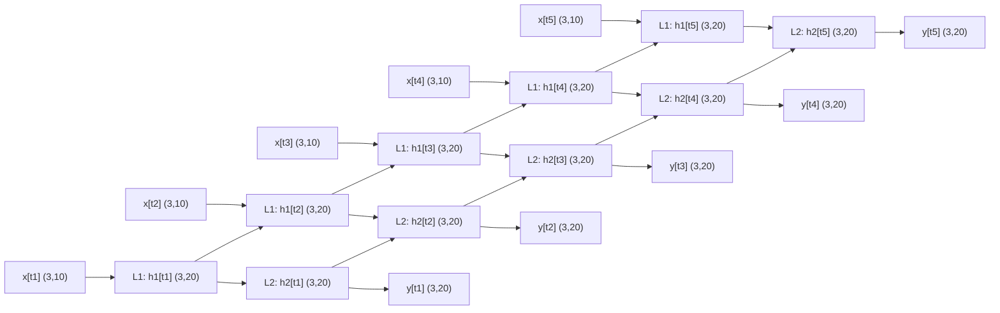

# Concepts

## Skeleton
- initialization: 입력, 은닉, 출력노드의 수 설정
- training: 학습 데이터들을 통해 학습하고 이에 따라 가중치 업데이트
- query: 입력을 받아 연산한 후 출력 노드에서 답을전달

```python
class NeuralNetwork:
  def __init__():
    pass

  def train():
    pass

  def query():
    pass
```

### KeyPoints
I = Input
O = Output
X = 입력값 (가중합) 예시) Xhidden은 은닉층 전체 노드들의 입력값 벡터
W = Weight

Xavier Init(https://huangdi.tistory.com/8)


## Init
```python
class NeuralNetwork:
  def __init__(self, inputnodes, hiddennodes, outputnodes, lr):
    self.inodes = inputnodes
    self.hnodes = hiddennodes
    self.onodes = outputnodes
    self.lr = lr
    
nn = NeuralNetwork(3, 3, 3, 0.3)
```

## Weight & Bias
```python
# Weights
self.wih = np.random.normal(0.0, pow(self.inodes, -0.5), (self.hnodes, self.inodes))

self.who = np.random.normal(0.0, pow(self.hnodes, -0.5), (self.onodes, self.hnodes))
```

### pow(self.inodes, -0.5)
`pow(self.inodes, -0.5)` =
$$\frac{1}{\sqrt{\text{입력노드 수}}}$$​
즉, 입력 노드 수가 많아질수록 가중치의 **분산(크기)** 를 줄여주는 역할을 한다.

왜?
반대로 너무 작으면 → 값이 0 근처에서만 움직여서 신호가 약해짐.

만약 입력 노드가 1000개인데, 가중치를 그냥 큰 값으로 주면,
→ 은닉층에 들어가는 값이 너무 커짐. 
→ 시그모이드 같은 활성화 함수는 **포화(saturation)** 되어 학습이 안 됨.

그래서 **1/√입력수**로 조정하면 “입력 수가 많아져도 출력 분산이 일정하게 유지”된다. 

이게 바로 **Xavier 초기화**의 기본 아이디어.


### 왜 정규분포(random.normal)로 초기화할까?
- 가중치를 전부 0이나 같은 값으로 시작하면, 모든 은닉 노드가 똑같은 계산을 해서 **대칭 깨기(symmetry breaking)** 가 안 된다 → 학습 불가능.
- 정규분포에서 **랜덤**으로 뽑아주면, 노드마다 조금씩 다른 출발점을 가지게 되어 학습이 제대로 된다.
    

👉 굳이 정규분포냐?
- 보통 `정규분포`(평균=0, 표준편차=1/√n)나 `균등분포`(−1/√n ~ 1/√n) 둘 다 씀.
- 여기서는 `정규분포`를 택했을 뿐.


## Query
- 신경망으로 들어오는 입력을 받아 출력을 반환
	- 신경망 입력 -> 은닉층 노드 입력 -> 은닉층 노드 출력 -> 최종 노드 입력 -> 최종 노드 출력
- 은닉노드와 출력 노드로 전달될때 활성화 함수 필요
```python
  def query(self, inputs_list):

    inputs = np.array(inputs_list, ndmin=2).T
    hidden_inputs = np.dot(self.wih, inputs)
    hidden_outputs = self.activation_function(hidden_inputs)

    final_inputs = np.dot(self.who, hidden_outputs)
    final_outputs = self.activation_function(final_inputs)

    return final_outputs
```

### 열 벡터
- `inputs_list`를 `np.array`로 만들되 최소 2D 보장(`ndmin=2`), 그리고 전치(`.T`)해서 **열벡터**로 만든다.
- **크기:** `(inodes, 1)`
- 왜? 가중치 행렬과의 행렬곱이 맞아떨어지게 하려면 입력이 열벡터여야 한다.
```python
inputs = np.array(inputs_list, ndmin=2).T
```

### 입력→은닉 선형결합
- `self.wih`는 `(hnodes, inodes)`
- `(hnodes, inodes) @ (inodes, 1) → (hnodes, 1)`
- **의미:** 각 은닉노드에 들어가는 가중합
```python
hidden_inputs = np.dot(self.wih, inputs)
```

$$\mathbf{h}_{in}​.$$
### 은닉 활성화
- 보통 `sigmoid`/`tanh`/`ReLU` 중 하나.
- **크기:** `(hnodes, 1)` (원소별 적용)
- **의미:** 비선형성 부여. 표현력↑, 포화/기울기 손실은 선택한 함수에 따라 다름.
```python
hidden_outputs = self.activation_function(hidden_inputs)
```


## Train
```python
  def train(self, inputs_list, targets_list):
    inputs = np.array(inputs_list, ndmin=2).T
    targets = np.array(targets_list, ndmin=2).T

    hidden_inputs = np.dot(self.wih, inputs)
    hidden_outputs = self.activation_function(hidden_inputs)

    final_inputs = np.dot(self.who, hidden_outputs)
    final_outputs = self.activation_function(final_inputs)

    output_errors = targets - final_outputs
    hidden_errors = np.dot(self.who.T, output_errors)

    self.who += self.lr * np.dot((
        output_errors * final_outputs * (1.0 - final_outputs)), np.transpose(hidden_outputs))
    self.wih += self.lr * np.dot((
        hidden_errors * hidden_outputs * (1.0 - hidden_outputs)), np.transpose(inputs))
```

### 순전파 (forward propagation)
- `wih @ inputs` → 은닉층 입력 (크기 `(hnodes, 1)`)
- 활성화 함수 통과 → 은닉층 출력 `(hnodes, 1)`
- `who @ hidden_outputs` → 출력층 입력 `(onodes, 1)`
- 활성화 함수 통과 → 최종 출력 `(onodes, 1)`
```python
hidden_inputs = np.dot(self.wih, inputs)
hidden_outputs = self.activation_function(hidden_inputs)

final_inputs = np.dot(self.who, hidden_outputs)
final_outputs = self.activation_function(final_inputs)
```

### 출력 오차 계산
- **출력층 오차** = 목표값 − 실제 출력값
- 크기: `(onodes, 1)`
```python
output_errors = targets - final_outputs
```

### 은닉층 오차 계산
출력층 오차를 은닉층으로 역전파.
who.T는 (hnodes, onodes), output_errors는 (onodes, 1) → 결과 (hnodes, 1)
의미: 은닉층의 각 노드가 출력 오차에 얼마나 기여했는지 계산.
```python
hidden_errors = np.dot(self.who.T, output_errors)
```

### 가중치 업데이트 (경사하강법)
- **출력층 가중치 업데이트**
- `output_errors * final_outputs * (1 - final_outputs)`
    - 시그모이드의 미분: $$f′(y)=y(1−y)f'(y) = y (1 - y)f′(y)=y(1−y). $$
    - 즉, **델타(δ)** = 오차 × 활성화 미분.
- 그 델타를 은닉층 출력에 곱해 경사(gradient) 계산.
- `np.dot(δ, hidden_outputs.T)` → `(onodes, hnodes)`
- 학습률 `lr`을 곱해 가중치 업데이트.
```python
self.who += self.lr * np.dot((
    output_errors * final_outputs * (1.0 - final_outputs)), np.transpose(hidden_outputs))
```

### 정리
```python
입력 x → [Wih] → 은닉 h → [Who] → 출력 y
        ↑                   ↓
     δh (hidden error)   δo (output error)

가중치 업데이트:
Wih += Wih + lr * δh * x^T
Who += Who + lr * δo * h^T
```


# 실습
## Layers


```python
# in_features: 입력 특성(또는 차원)의 수입니다.
# out_features: 출력 특성(또는 차원)의 수입니다.
# bias: 편향을 사용할지 여부를 결정하는 부울 값입니다. 기본값은 True이며, 이 경우 학습 가능한 편향이 추가됩니다.

linear_layer = nn.Linear(in_features=10, out_features=5, bias=True)

# 임의의 데이터 생성
# 예시를 위해 배치 크기가 1, 입력 특성의 개수가 10인 텐서 생성
input_tensor = torch.randn(1, 10)

# 생성한 Linear 레이어에 입력 데이터를 전달하여 출력 데이터를 얻음
output_tensor = linear_layer(input_tensor)

print('입력 층:', input_tensor.size())
print('출력 층:', output_tensor.size())
print('출력 결과: ', output_tensor)

입력 층: torch.Size([1, 10])
출력 층: torch.Size([1, 5])
출력 결과:  tensor([[ 0.7064, -0.2442,  0.1907,  0.1106,  0.1371]],
       grad_fn=<AddmmBackward0>)
```

### 예시: CNN
아래와 같은 조건으로 2차원 컨볼루션 레이어(Convolution Layers)을 생성해 봅시다.
- 입력 채널의 수: 3
- 출력 채널의 수: 16
- 커널 사이즈: 3
- 스트라이드: 1
- 패딩: 0
- 편향: 사용
```python
# in_channels: 입력 채널의 수입니다. 
# out_channels: 출력 채널의 수입니다.
# kernel_size: 커널(필터)의 크기입니다. 정수 혹은 (높이, 너비) 형태의 튜플을 사용할 수 있습니다.
# stride: 필터를 적용하는 스트라이드의 크기입니다. 기본값은 1입니다.
# padding: 입력의 각 측면에 추가할 패딩의 크기입니다. 기본값은 0입니다.
# bias: 편향을 사용할지 여부를 결정하는 부울 값입니다. 기본값은 True입니다.

conv_layer = nn.Conv2d(in_channels=3, out_channels=16, kernel_size=3, stride=1, padding=0, bias=True)

# 예시를 위해 배치 크기가 1, 입력 채널이 3, 이미지 크기가 32x32인 텐서 생성
input_tensor = torch.randn(1, 3, 32, 32)

# 생성한 컨볼루션 레이어에 입력 데이터를 전달하여 출력 데이터를 얻음
output_tensor = conv_layer(input_tensor)

print('입력 층:', input_tensor.size())
print('출력 층:', output_tensor.size())
print('출력 결과: ', output_tensor)

입력 층: torch.Size([1, 3, 32, 32])
출력 층: torch.Size([1, 16, 30, 30])
출력 결과:  tensor([[[[ 0.5208, -0.9189,  0.2280,  ..., -0.1919,  0.1242, -0.0828],
          [ 0.9697, -1.3352, -0.3450,  ..., -0.0352, -0.2639,  0.7232],
          [ 0.8163, -0.6737, -0.2062,  ..., -0.2410,  0.3318,  0.6730],
          ...,
```

### 예시: MaxPooling
```python
# kernel_size: 풀링을 적용할 윈도우의 크기입니다.
# stride: 윈도우를 이동시키는 스트라이드의 크기입니다. 기본값은 kernel_size와 같습니다.
# padding: 입력의 각 측면에 추가할 패딩의 크기입니다. 기본값은 0입니다.

max_pool = nn.MaxPool2d(kernel_size=2, stride=1, padding=0)

# 임의의 이미지 데이터 생성
# 예시를 위해 배치 크기가 1, 채널 수가 16, 이미지 크기가 32x32인 텐서 생성
input_tensor = torch.randn(1, 16, 32, 32)

# 생성한 MaxPool2d 레이어에 입력 데이터를 전달하여 출력 데이터를 얻음
output_tensor = max_pool(input_tensor)

print('입력 층:', input_tensor.size())
print('출력 층:', output_tensor.size())
print('출력 결과: ', output_tensor)

입력 층: torch.Size([1, 16, 32, 32])
출력 층: torch.Size([1, 16, 31, 31])
출력 결과:  tensor([[[[ 9.9527e-01,  1.2985e+00,  1.9577e+00,  ...,  1.2490e+00,
           -4.8264e-01,  1.3662e+00],
          [ 3.6265e-01,  1.2985e+00,  1.2985e+00,  ..., -4.4863e-01,
            7.2961e-01,  7.2961e-01],
          [-6.5153e-01, -6.5153e-01,  1.1787e+00,  ..., -1.8452e-02,
            7.2961e-01,  7.2961e-01],
          ...,
```

### 예시: RNN
```python
# RNN 레이어 생성
# input_size: 입력 특성의 개수
# hidden_size: 숨겨진 상태의 특성 개수
# num_layers: RNN 층의 수
# bias: 바이어스 사용 여부
# batch_first: 입력 및 출력 텐서의 첫 번째 차원이 배치 크기인지 여부

rnn = nn.RNN(input_size=10, hidden_size=20, num_layers=2, bias=True, batch_first=False) 

# 예시를 위해 시퀀스 길이가 5, 배치 크기가 3, 입력 크기가 10인 텐서 생성
input_seq = torch.randn(5, 3, 10)

# 상태의 크기는 (num_layers, batch, hidden_size)
hidden_state = torch.randn(2, 3, 20)

# RNN에 입력 시퀀스를 전달하고, 출력과 최종 숨겨진 상태를 얻음
output_seq, final_hidden_state = rnn(input_seq, hidden_state)

print('입력 층:', input_seq.size())
print('히든 층:', hidden_state.size())
print('최종 히든 층:', final_hidden_state.size())
print('출력 층:', output_seq.size())

입력 층: torch.Size([5, 3, 10])
히든 층: torch.Size([2, 3, 20])
최종 히든 층: torch.Size([2, 3, 20])
출력 층: torch.Size([5, 3, 20])
```



