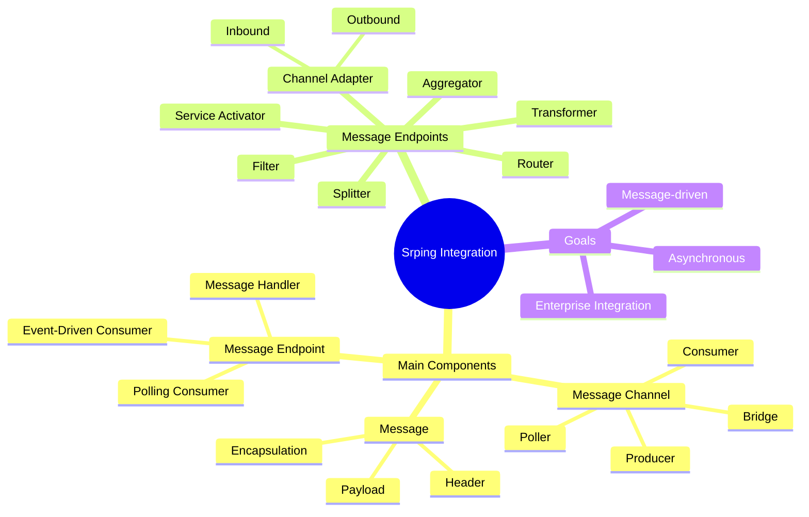

## Overview
Spring Integration은 스프링 기반 애플리케이션에서 경량 메시지를 사용가능하게 하고 외부 시스템을 선언적 어댑터로 쉽게 통합할 수 있는 기능을 제공한다. 이런 어댑터들은 높은 수준의 추상화 레벨을 제공하기 때문에 어댑터들을 통해서 개발자들이 조금 더 비지니스 로직에 집중할 수 있도록 도와준다.

Spring Integration을 구현하는 방법은 xml 구성, java config 구성, java dsl이 있는데 이 글은 java config 구성 위주로 작성했다. dsl에 대한 자세한 정보는 [https://docs.spring.io/spring-integration/docs/5.3.1.RELEASE/reference/html/dsl.html#java-dsl](https://docs.spring.io/spring-integration/docs/5.3.1.RELEASE/reference/html/dsl.html#java-dsl) 에서 확인할 수 있다.

## Components
Spring Integration 은 하나 이상의 컴포넌트로 구성된다 각각 컴포넌트들의 종류는 아래와 같다.

- **채널**: 한 요소로부터 다른 요소로 메시지를 전달
- **필터**: 조건에 맞는 메시지가 플로우를 통과하게 해줌
- **변환기**: 메시지 값을 변경하거나 메시지 페이로드의 타입을 다른 타입으로 변환
- **라우터**: 여러 채널 중 하나로 메시지를 전달하며 대개 메시지 헤더를 기반으로 함
- **분배기**: 들어오는 메시지를 두 개 이상의 메시지로 분할하며, 분할된 각 메시지는 다른 채널로 전송
- **집적기**: 분배기와 상반된 것으로 별개의 채널로부터 전달되는 다수의 메시지를 하나의메시지로 결합함
- **서비스 액티베이터**: 메시지를 처리하도록 자바 메서드에 메시지를 넘겨준 후 메서드의 반환값을 출력 채널로 전송
- **채널 어댑터**: 외부 시스템에 채널을 연결함. 외부 시스템으로부터 입력을 받거나 쓸 수 있음
- **게이트웨이**: 인터페이스를 통해 통합플로우로 데이터를 전달

### 필터 (filter)
필터는 통합 파이프라인의 중간에 위치할 수 있고 플로우의 전 단계로부터 다음 단계로의 메시지 전달을 허용 또는 불허한다.
```java
//짝수만 evenNumberChannel로 보내는 필터
@Filter(inputCjhannel="numberChannel", outputChannel="evenNumberChannel")
public boolean evenNumberFilter(Integer num) {
  return number % 2 == 0;
}
```

### 변환기 (transformer)
메시지 값의 변경이나 타입을 변환하는 일을 수행한다.
```java
//일반 number를 romannumber로 변환하는 변환기
@Transformer(inputChannel="numberChannel", outputChannel="romanNumberChannel")
public GenericTransformer<Integer, String> romanNumTransformer() {
  return RomanNumbers::toRoman;
}
```

### 라우터 (router)
전달 조건을 기반으로 통합 플로우 내부를 분기한다.
메시지에 적용된 조건을 기반으로 서로 다른 채널로 메시지를 전달한다.
```java
    @Bean
    @Router(inputChannel = "numberChannel")
    public AbstractMessageRouter evenOddRouter() {
        return new AbstractMessageRouter() {
            @Override
            protected Collection<MessageChannel> determineTargetChannels(Message<?> message) {
                Integer num = (Integer) message.getPayload();
                if(num % 2 == 0) {
                    return Collections.singleton(evenChannel());
                }else {
                    return Collections.singleton(oddChannel());
                }
            }
        };
    }

    @Bean
    public MessageChannel evenChannel() {
        return new DirectChannel();
    }

    @Bean
    public MessageChannel oddChannel() {
        return new DirectChannel();
    }

```

### 분배기 (splitter)
통합 플로우에서 하나의 메시지를 여러 개로 분할하여 독립적으로 처리하는 것이 유용할 수 있다.
분배기를 사용할 수 있는 중요한 두가지 경우:
    - 메시지 페이로드가 같은 타입의 컬렉션항목들을 포함하며, 각 메시지 페이로드 별로 처리하고자 할 때 예를 들어 여러 가지 종류의 제품이 있으며, 제품리스트를 전달하는 메시지는 각각 한 종류 제품의 페이로드를 갖는 다수의 메시지로 분할 될 수 있다.
    - 연관된 정보를 함께 전달하는 하나의 메시지 페이로드는 두 개 이상의 서로 다른 타입 메시지로 분할될 수 있다. 예를 들어 주문 메시지는 배달 정보 대금 청구 정보 주문 항목 정보를 전달할 수 있으며, 각 정보는 서로 다른 하위 플로우에서 처리될 수 있다. 이 경우는 일반적으로 분배기 다음에 페이로드 타입 별로 메시지를 전달하는 라우터가 연결된다. 적합한 하위 플로우에서 데이터가 처리되도록 하기 위해서다.
```java
public class OderSplitter {
  public Collection<Object> splitOrderIntoParts(PurchaseOrder po) {
    ArrayList<Object> parts = new ArrayList<>();
    parts.add(po.getBillingInfo());
    parts.add(po.getLineItems());
    return parts;
  }
}


...

@Bean
@Splitter(inputChannel="poChannel", outputChannel="splitOrderChannel")
public OrderSplitter orderSplitter() {
    return new OrderSplitter();
}

...
    
@Bean
@Router(inputChannel="splitOrderChannel")
public MessageRouter splitOrderRouter() {
    PayloadTypeRouter router = new PayloadTypeRouter();
    router.setChannelMapping(BillingInfo.class.getname(), "billingInfoChannel");
    router.setChannelMapping(List.class.getname(), "lineItemsChannel");
    return router;
}

//다시 lineItemsChannel로 들어오는 List를 처리하고싶다면 ?
@Splitter(inputChannel="lineItemsChannel", outputChannel="lineItemChannel")
public List<LineItem> lineItemSplitter(List<LineItem> lineItems) {
    return lineItems;
}


```

### 서비스 액티베이터 (service activator)
- 입력 채널로부터 메시지를 수신하고 이 메시지를 MessageHandler 인터페이스를 구현한 클래스에 전달한다.
- 스프링 통합은 MessageHandler를 구현한 여러 클래스를 제공한다.
```java
    @Bean
    @ServiceActivator(inputChannel ="someChannel")
    public MessageHandler sysoutHandler() {
        return message -> System.out.println("message payload: " + message.getPayload());
    }

```

```java
    @Bean
    @ServiceActivator(inputChannel ="someChannel", outputChannel = "completeChannel")
    public GenericHandler<Order> orderHandler(OrderRepository orderRepository) {
        return (o, messageHeaders) -> orderRepository.save(); 
    }
```

### 게이트웨이 (gateway)
- 애플리케이션이 통합 플로우로 데이터를 제출하고 선택적으로 플로우의 처리 결과인 응답을 받을 수 있는 수단이다.
- 스프링 통합에 구현된 게이트웨이는 애플리케이션이 통합 플로우로 메시지를 전송하기 위해 호출할 수 있는 인터페이스로 구체화 되어 있다.
- FileWriterGateway는 단방향 게이트웨이다.
```java
package me.sup2is;

import org.springframework.integration.annotation.MessagingGateway;
import org.springframework.stereotype.Component;

@Component
@MessagingGateway(defaultRequestChannel = "inChannel", defaultReplyChannel = "outChannel")
public interface UpperCaseGateway {
    String uppercase(String in);
}

```

- 스프링이 알아서 구현체를 제공한다.

### 채널 어댑터 (channel adapter)
채널 어댑터는 통합 플로우의 입구와 출구를 나타낸다. 데이터는 인바운드 채널 어댑터를 통해 통합 플로우로 들어오고 아웃바운드 채널 어댑터를 통 통합 플로우에서 나간다.
```
    @Bean
    @InboundChannelAdapter(poller = @Poller(fixedRate = "1000", errorChannel = "numberChannel"))
    public MessageSource<Integer> numberSource(AtomicInteger source) {
        return () -> new GenericMessage<>(source.getAndIncrement());
    }

```

- 이 빈은 주입된 AutomicInteger로부터 numberChannel 이라는 이름의 채널로 매초 마다 한번씩 숫자를 전달한다.
- 메시지 핸들러로 구현되는 서비스 액티베이터는 아웃바운드 채널 어댑터로 자주 사용됨 특히 데이터가 애플리케이션 자체에 전달될 필요가 있을때 사용한다.

## 마무리
Spring Integration이 제공하는 endpoint는 다음과 같다.

|Module|Inbound Adapter|Outbound Adapter|Inbound Gateway|Outbound Gateway|
|---|---|---|---|---|
|**AMQP**|[Inbound Channel Adapter](https://docs.spring.io/spring-integration/reference/html/amqp.html#amqp-inbound-channel-adapter)|[Outbound Channel Adapter](https://docs.spring.io/spring-integration/reference/html/amqp.html#amqp-outbound-channel-adapter)|[Inbound Gateway](https://docs.spring.io/spring-integration/reference/html/amqp.html#amqp-inbound-gateway)|[Outbound Gateway](https://docs.spring.io/spring-integration/reference/html/amqp.html#amqp-outbound-gateway)|
|**Events**|[Receiving Spring Application Events](https://docs.spring.io/spring-integration/reference/html/event.html#appevent-inbound)|[Sending Spring Application Events](https://docs.spring.io/spring-integration/reference/html/event.html#appevent-outbound)|N|N|
|**Feed**|[Feed Inbound Channel Adapter](https://docs.spring.io/spring-integration/reference/html/feed.html#feed-inbound-channel-adapter)|N|N|N|
|**File**|[Reading Files](https://docs.spring.io/spring-integration/reference/html/file.html#file-reading) and [‘tail’ing Files](https://docs.spring.io/spring-integration/reference/html/file.html#file-tailing)|[Writing files](https://docs.spring.io/spring-integration/reference/html/file.html#file-writing)|N|[Writing files](https://docs.spring.io/spring-integration/reference/html/file.html#file-writing)|
|**FTP(S)**|[FTP Inbound Channel Adapter](https://docs.spring.io/spring-integration/reference/html/ftp.html#ftp-inbound)|[FTP Outbound Channel Adapter](https://docs.spring.io/spring-integration/reference/html/ftp.html#ftp-outbound)|N|[FTP Outbound Gateway](https://docs.spring.io/spring-integration/reference/html/ftp.html#ftp-outbound-gateway)|
|**Gemfire**|[Inbound Channel Adapter](https://docs.spring.io/spring-integration/reference/html/gemfire.html#gemfire-inbound) and [Continuous Query Inbound Channel Adapter](https://docs.spring.io/spring-integration/reference/html/gemfire.html#gemfire-cq)|[Outbound Channel Adapter](https://docs.spring.io/spring-integration/reference/html/gemfire.html#gemfire-outbound)|N|N|
|**HTTP**|[HTTP Namespace Support](https://docs.spring.io/spring-integration/reference/html/http.html#http-namespace)|[HTTP Namespace Support](https://docs.spring.io/spring-integration/reference/html/http.html#http-namespace)|[Http Inbound Components](https://docs.spring.io/spring-integration/reference/html/http.html#http-inbound)|[HTTP Outbound Components](https://docs.spring.io/spring-integration/reference/html/http.html#http-outbound)|
|**JDBC**|[Inbound Channel Adapter](https://docs.spring.io/spring-integration/reference/html/jdbc.html#jdbc-inbound-channel-adapter) and [Stored Procedure Inbound Channel Adapter](https://docs.spring.io/spring-integration/reference/html/jdbc.html#stored-procedure-inbound-channel-adapter)|[Outbound Channel Adapter](https://docs.spring.io/spring-integration/reference/html/jdbc.html#jdbc-outbound-channel-adapter) and [Stored Procedure Outbound Channel Adapter](https://docs.spring.io/spring-integration/reference/html/jdbc.html#stored-procedure-outbound-channel-adapter)|N|[Outbound Gateway](https://docs.spring.io/spring-integration/reference/html/jdbc.html#jdbc-outbound-gateway) and [Stored Procedure Outbound Gateway](https://docs.spring.io/spring-integration/reference/html/jdbc.html#stored-procedure-outbound-gateway)|
|**JMS**|[Inbound Channel Adapter](https://docs.spring.io/spring-integration/reference/html/jms.html#jms-inbound-channel-adapter) and [Message-driven Channel Adapter](https://docs.spring.io/spring-integration/reference/html/jms.html#jms-message-driven-channel-adapter)|[Outbound Channel Adapter](https://docs.spring.io/spring-integration/reference/html/jms.html#jms-outbound-channel-adapter)|[Inbound Gateway](https://docs.spring.io/spring-integration/reference/html/jms.html#jms-inbound-gateway)|[Outbound Gateway](https://docs.spring.io/spring-integration/reference/html/jms.html#jms-outbound-gateway)|
|**JMX**|[Notification-listening Channel Adapter](https://docs.spring.io/spring-integration/reference/html/jmx.html#jmx-notification-listening-channel-adapter) and [Attribute-polling Channel Adapter](https://docs.spring.io/spring-integration/reference/html/jmx.html#jmx-attribute-polling-channel-adapter) and [Tree-polling Channel Adapter](https://docs.spring.io/spring-integration/reference/html/jmx.html#tree-polling-channel-adapter)|[Notification-publishing Channel Adapter](https://docs.spring.io/spring-integration/reference/html/jmx.html#jmx-notification-publishing-channel-adapter) and [Operation-invoking Channel Adapter](https://docs.spring.io/spring-integration/reference/html/jmx.html#jmx-operation-invoking-channel-adapter)|N|[Operation-invoking Outbound Gateway](https://docs.spring.io/spring-integration/reference/html/jmx.html#jmx-operation-invoking-outbound-gateway)|
|**JPA**|[Inbound Channel Adapter](https://docs.spring.io/spring-integration/reference/html/jpa.html#jpa-inbound-channel-adapter)|[Outbound Channel Adapter](https://docs.spring.io/spring-integration/reference/html/jpa.html#jpa-outbound-channel-adapter)|N|[Updating Outbound Gateway](https://docs.spring.io/spring-integration/reference/html/jpa.html#jpa-updating-outbound-gateway) and [Retrieving Outbound Gateway](https://docs.spring.io/spring-integration/reference/html/jpa.html#jpa-retrieving-outbound-gateway)|
|**Mail**|[Mail-receiving Channel Adapter](https://docs.spring.io/spring-integration/reference/html/mail.html#mail-inbound)|[Mail-sending Channel Adapter](https://docs.spring.io/spring-integration/reference/html/mail.html#mail-outbound)|N|N|
|**MongoDB**|[MongoDB Inbound Channel Adapter](https://docs.spring.io/spring-integration/reference/html/mongodb.html#mongodb-inbound-channel-adapter)|[MongoDB Outbound Channel Adapter](https://docs.spring.io/spring-integration/reference/html/mongodb.html#mongodb-outbound-channel-adapter)|N|N|
|**MQTT**|[Inbound (Message-driven) Channel Adapter](https://docs.spring.io/spring-integration/reference/html/mqtt.html#mqtt-inbound)|[Outbound Channel Adapter](https://docs.spring.io/spring-integration/reference/html/mqtt.html#mqtt-outbound)|N|N|
|**Redis**|[Redis Inbound Channel Adapter](https://docs.spring.io/spring-integration/reference/html/redis.html#redis-inbound-channel-adapter) and [Redis Queue Inbound Channel Adapter](https://docs.spring.io/spring-integration/reference/html/redis.html#redis-queue-inbound-channel-adapter) and [Redis Store Inbound Channel Adapter](https://docs.spring.io/spring-integration/reference/html/redis.html#redis-store-inbound-channel-adapter)|[Redis Outbound Channel Adapter](https://docs.spring.io/spring-integration/reference/html/redis.html#redis-outbound-channel-adapter) and [Redis Queue Outbound Channel Adapter](https://docs.spring.io/spring-integration/reference/html/redis.html#redis-queue-outbound-channel-adapter) and [RedisStore Outbound Channel Adapter](https://docs.spring.io/spring-integration/reference/html/redis.html#redis-store-outbound-channel-adapter)|[Redis Queue Inbound Gateway](https://docs.spring.io/spring-integration/reference/html/redis.html#redis-queue-inbound-gateway)|[Redis Outbound Command Gateway](https://docs.spring.io/spring-integration/reference/html/redis.html#redis-outbound-gateway) and [Redis Queue Outbound Gateway](https://docs.spring.io/spring-integration/reference/html/redis.html#redis-queue-outbound-gateway)|
|**Resource**|[Resource Inbound Channel Adapter](https://docs.spring.io/spring-integration/reference/html/resource.html#resource-inbound-channel-adapter)|N|N|N|
|**RMI**|N|N|[Inbound RMI](https://docs.spring.io/spring-integration/reference/html/rmi.html#rmi-inbound)|[Outbound RMI](https://docs.spring.io/spring-integration/reference/html/rmi.html#rmi-outbound)|
|**RSocket**|N|N|[RSocket Inbound Gateway](https://docs.spring.io/spring-integration/reference/html/rsocket.html#rsocket-inbound)|[RSocket Outbound Gateway](https://docs.spring.io/spring-integration/reference/html/rsocket.html#rsocket-outbound)|
|**SFTP**|[SFTP Inbound Channel Adapter](https://docs.spring.io/spring-integration/reference/html/sftp.html#sftp-inbound)|[SFTP Outbound Channel Adapter](https://docs.spring.io/spring-integration/reference/html/sftp.html#sftp-outbound)|N|[SFTP Outbound Gateway](https://docs.spring.io/spring-integration/reference/html/sftp.html#sftp-outbound-gateway)|
|**STOMP**|[STOMP Inbound Channel Adapter](https://docs.spring.io/spring-integration/reference/html/stomp.html#stomp-inbound-adapter)|[STOMP Outbound Channel Adapter](https://docs.spring.io/spring-integration/reference/html/stomp.html#stomp-outbound-adapter)|N|N|
|**Stream**|[Reading from Streams](https://docs.spring.io/spring-integration/reference/html/stream.html#stream-reading)|[Writing to Streams](https://docs.spring.io/spring-integration/reference/html/stream.html#stream-writing)|N|N|
|**Syslog**|[Syslog Inbound Channel Adapter](https://docs.spring.io/spring-integration/reference/html/syslog.html#syslog-inbound-adapter)|N|N|N|
|**TCP**|[TCP Adapters](https://docs.spring.io/spring-integration/reference/html/ip.html#tcp-adapters)|[TCP Adapters](https://docs.spring.io/spring-integration/reference/html/ip.html#tcp-adapters)|[TCP Gateways](https://docs.spring.io/spring-integration/reference/html/ip.html#tcp-gateways)|[TCP Gateways](https://docs.spring.io/spring-integration/reference/html/ip.html#tcp-gateways)|
|**UDP**|[UDP Adapters](https://docs.spring.io/spring-integration/reference/html/ip.html#udp-adapters)|[UDP Adapters](https://docs.spring.io/spring-integration/reference/html/ip.html#udp-adapters)|N|N|
|**WebFlux**|[WebFlux Inbound Channel Adapter](https://docs.spring.io/spring-integration/reference/html/webflux.html#webflux-inbound)|[WebFlux Outbound Channel Adapter](https://docs.spring.io/spring-integration/reference/html/webflux.html#webflux-outbound)|[Inbound WebFlux Gateway](https://docs.spring.io/spring-integration/reference/html/webflux.html#webflux-inbound)|[Outbound WebFlux Gateway](https://docs.spring.io/spring-integration/reference/html/webflux.html#webflux-outbound)|
|**Web Services**|N|N|[Inbound Web Service Gateways](https://docs.spring.io/spring-integration/reference/html/ws.html#webservices-inbound)|[Outbound Web Service Gateways](https://docs.spring.io/spring-integration/reference/html/ws.html#webservices-outbound)|
|**Web Sockets**|[WebSocket Inbound Channel Adapter](https://docs.spring.io/spring-integration/reference/html/web-sockets.html#web-socket-inbound-adapter)|[WebSocket Outbound Channel Adapter](https://docs.spring.io/spring-integration/reference/html/web-sockets.html#web-socket-outbound-adapter)|N|N|
|**XMPP**|[XMPP Messages](https://docs.spring.io/spring-integration/reference/html/xmpp.html#xmpp-messages) and [XMPP Presence](https://docs.spring.io/spring-integration/reference/html/xmpp.html#xmpp-presence)|[XMPP Messages](https://docs.spring.io/spring-integration/reference/html/xmpp.html#xmpp-messages) and [XMPP Presence](https://docs.spring.io/spring-integration/reference/html/xmpp.html#xmpp-presence)|N|N|