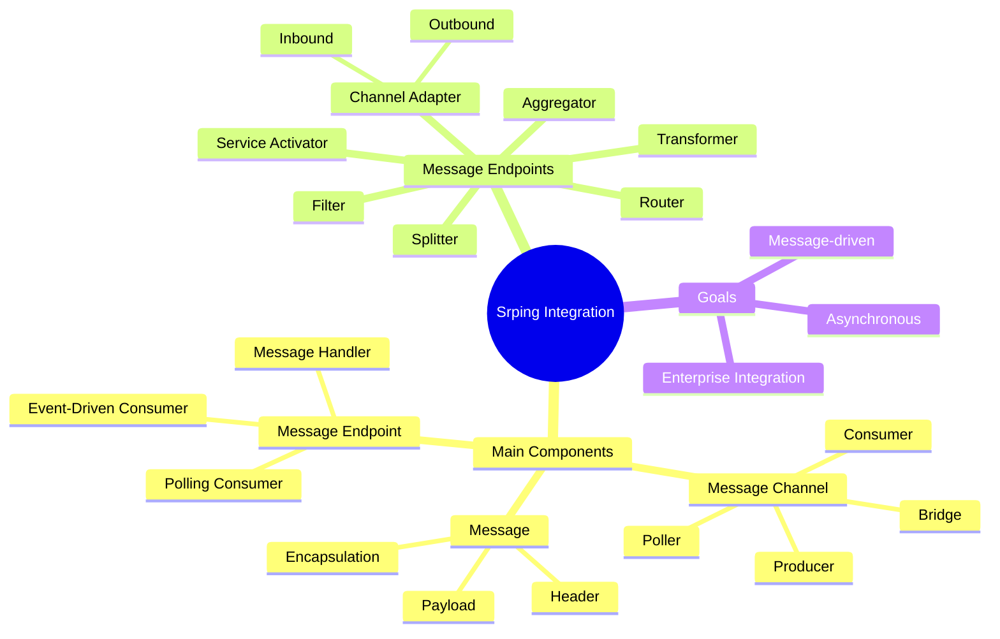

공식 문서에서 정의한 [Spring Integration](https://spring.io/projects/spring-integration) 은 다음과 같다:

> Spring 프로그래밍 모델을 확장하여 Enterprise Integration Pattern에 나오는 패턴들을 구현한 통합 프레임 워크이다. Enterprise Integration Pattern이란, 엔터프라이즈 환경에서 사용하고있는 다양한 서비스를 필요에 따라 잘 융화시키기 위해 파일 전송, 데이터베이스 공유, 원격 프로시저, 메세징 기능과 같은 다양한 방법을 의미한다.
> 
> Spring Integration은 Spring Application 내에서 가벼운 메시징을 가능하게 하며 선언적 (declarative) 어댑터를 통한 외부 시스템과의 통합을 지원한다. 이러한 어댑터는 Spring의 원격 호출, 메시징 및 원격 파일 관리에 대한 높은 수준의 추상화를 제공한다.
> 
> Spring Integration의 주요 목표는 유지 관리 가능하고 테스트 가능한 코드를 생성하는 관심사의 분리 (separation of concerns)를 유지하면서, EAI (Enterprise Application Integration)를 구축하는 간단한 모델을 제공하는 것이다.

## Overview
공식 문서의 정의를 정리해보면 Spring Integration은 스프링 기반 애플리케이션에서 경량 메시지를 사용가능하게 하고 외부 시스템을 선언적 어댑터로 쉽게 통합할 수 있는 기능을 제공한다. 이런 어댑터들은 높은 수준의 추상화 레벨을 제공하기 때문에 어댑터들을 통해서 개발자들이 조금 더 비지니스 로직에 집중할 수 있도록 도와준다.
## Components
spring integration은 'pipes and filters' 모델을 구현하기 위해 3가지 핵심 개념으로 구성되어 있다.
### Message
header, payload로 구성되어 있는, 내용을 포함하고 있는 generic wrapper이다. 컴포넌트 간에 이동되는 실제 데이터다.

### Message Channel
_“pipes and filters”_ 모델의 pipe에 해당. 컴포넌트간의 메세지 중간 통로 역할을 함으로써 컴포넌트간 디커플링을 유지할 수 있도록 하며 interception, monitoring 포인트가 될 수 있다. 메세지 채널의 모델은 크게 두가지가 있는데, 하나의 consumer가 메세지를 받을 수 있는 `point-to-point`, 어려 subscriber가 메세지를 broadcast 받을 수 있는 `publish-subscribe` 모델이 있다. 여기서 중점적으로 봐야될 것은 두 가지 모델이 있지만 메세지 채널의 다른 하나의 중요 기능은 메세지 버퍼 역할을 할 수 있는 큐로써 동작한다는 것이다.

### Message Endpoint
spring integration 상에서 채널을 통해서 메세지를 받고 소비하는 주체이다. 여기서 말하는 엔드포인트란 spring integration이 구성할 파이프라인의 최종 끝단이 아니라, 파이프라인의 중간에서 메세지를 변경하거나 필터링하거나 또는 여러 다른 채널로 라우팅하는 요소이다.

spring integration에서 일련의 작업들을 정의한 플로우를 `integration flow`라고 하는데 이 플로우가 message endpoint로 구성되어 있다. 엔드포인트는 작업 타입에 따라 종류를 나눌 수 있다:
- Transformer (변형)
- Filter (필터링)
- Router (메세지를 특정 채널로 전송)
- Splitter (메세지를 분리하여 여러 채널로 전송)
- Aggregator (splitter의 반대)
- Service Activator (메세지로 특정 작업을 수행할 수 있는 핸들러를 붙일 수 있는 엔드포인트)
- Channel Adapter (외부 시스템과 입출력이 가능)