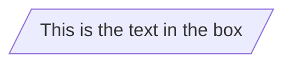
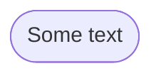
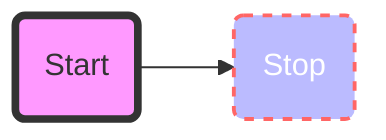
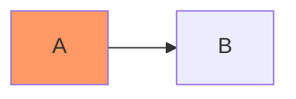
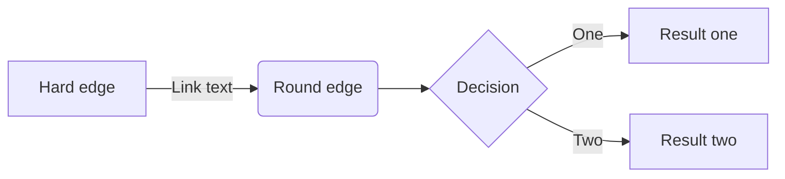

### Parallelogram
```
flowchart TD
    id1[/This is the text in the box/]
```


### Long Round
```
flowchart TD
id1([Some text])
```



<br>

### Basic support for fontawesome
```
flowchart TD
    B["fa:fa-twitter for peace"]
    B-->C[fa:fa-ban forbidden]
    B-->D(fa:fa-spinner)
    B-->E(A fa:fa-camera-retro perhaps?)
```


<br>

### Styling a node

#### Type 1
```
flowchart LR
    id1(Start)-->id2(Stop)
    style id1 fill:#f9f,stroke:#333,stroke-width:4px
    style id2 fill:#bbf,stroke:#f66,stroke-width:2px,color:#fff,stroke-dasharray: 5 5
```


#### Type 2
```
flowchart LR
    A:::someclass --> B
    classDef someclass fill:#f96
```



<br>

### FlowChart Text
```
flowchart LR
    A[Hard edge] -->|Link text| B(Round edge)
    B --> C{Decision}
    C -->|One| D[Result one]
    C -->|Two| E[Result two]
```

