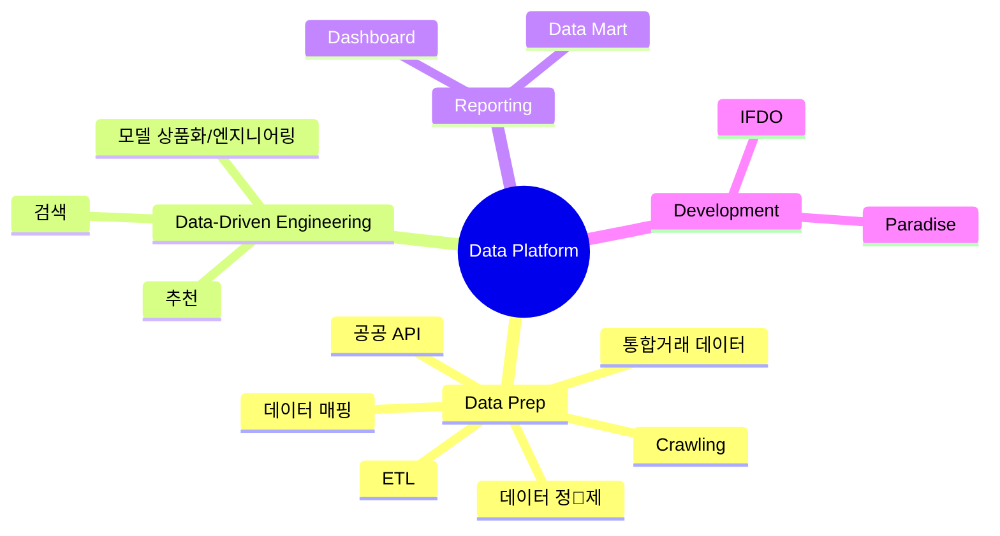

## Overview
 “**Assignee가 꼭 확정된 것은 아니니, please raise your hand.**”

나의 명확한 Role 을 요청하고 싶어서 마련한 자리. 그리고 3Q 대비.

전체적인 그림을 봤을때 현재 BI팀에서 도구와 재료는 쓸만한것들이 많은데 활용이 안되고있어 아쉽다.
- 데이터
	- 통합 거래 데이터
	- 크롤링 (메뉴, 레시피)
	- GA4
	- 데이터 정제
- 분석
	- 수많은 대시보드
	- 분석가들의 분석역량
- 엔지니어링
	- API 개발
	- 인프라 구축 및 개선
	- 장애대응
	- 모니터링
	- 데이터 엔지니어링
- 도메인 지식 (식봄)
- 데이터 사이언스
- 데이터 플랫폼 (DW)

---

## Problem Statement
Data Commerce 팀에서 데이터를 효과적으로 엔지니어링하고 활용하기 위해 필요한것은?

### How Data Should Flow

### Modeling Requirements

→ 모델링을 하기위해서도 모델을 위한 인프라가 필요하다.

---

## Do’s and Dont’s
### ❌ Don’t

### ✅ Do

----
## Roles

---

## 모델 상품화?
최종 선택된 모델을 **실제 Application으로 상품화 후 배포** 진행.
배포된 모델이 서비스에 적용되어 Business Value 창출

### ML LifeCycle
### A.모델 개발
- 데이터 수집 및 준비
- Feature Engineering : 성능 좋은 모델을 만들기 위해, 주어진 데이터를 가공하여 Feature을 만드는 방법
- 모델 선정 및 학습 : 해결하고자 하는 문제에 적합한 모델들을 선정하고 학습
- 모델 평가 및 튜닝 : 학습된 모델의 성능을 평가, 하이퍼파라미터를 조정하여 보다 최적의 모델을 찾음

### **✅ B.상품화**
- **배포 및 모니터링** : 생성된 모델을 운영단에 올리고, 잘 동작하는지 모니터링
- **재평가 및 모델 업데이트** : 시간이 지나고 새로운 데이터에 대해 모델의 성능을 재평가, 필요시 재학습을 통한 업데이트

### 추천 때는…
ML 인프라나 Scientist가 없어서 전부 Managed Platform 사용하였음.

#### Amazon Personalize
- 추천에만 특화

#### SageMaker
- 간단하게 시작하기엔 부담스러운 가격과 인프라
- Scientist 입장에서 부담스러운 Learning Curve

#### Vertex AI
- 간단하게 시작하기엔 부담스러운 가격과 인프라
- Scientist 입장에서 부담스러운 Learning Curve

---

## 이 Role 을 통해 얻고자 하는것 (그리고 목표)
- 모델 활용으로 Software / Data Engineering  만으로 풀수 없는 복잡한 문제 해결
- 그동안 묵혀두었던 Data 를 ‘제대로’ 활용해볼 수 있는 기회
- 모델러는 모델 개발에 집중할 수 있도록 서포트 → 업무 관련성/역량 향상 UP
- 물흐르듯 자연스러운 모델 자동화
- Dataflow star model 의 완성
- 모델로만 풀 수 있는 복잡한 과제 정의 및 해결

### 해결하고자 하는것(Role-specific/엔지니어링 측면)

