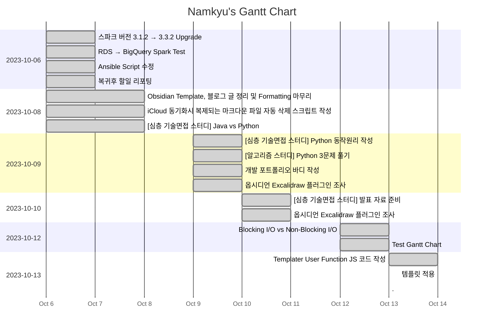

---
tags:
  - dailies
---
<< [[2023-10-12|Yesterday]] | [[2023-10-14|Tomorrow]] | [[2023-10-11|그저께]] | [[2023-10-15|모레]] >>

> [!warning]+ [[Action Dashboard| OverDue ]]
> ```tasks
> not done
> sort by due date
> due before 2023-10-13
> hide due date
> hide backlink
> limit 5
> ```

> [!todo]+ Today's Tasks
> ```tasks
> not done
> due 2023-10-13
> sort by path
> sort by priority
> hide due date
> hide backlink
> limit 5
> ```

> [!todo]+ Upcoming Tasks
> ```tasks  
> not done  
> due after 2023-10-13
> sort by due date
> sort by priority  



---

# To Do.

#### 오전
- [x] Templater User Function JS  코드 작성 🛫 2023-10-13 📅 2023-10-14 ✅ 2023-10-14


#### 오후
- [x] 템플릿 적용 🛫 2023-10-1 📅 2023-10-14 ✅ 2023-10-14


---


# 고민중
- 


---

# More Works To Be Done.

