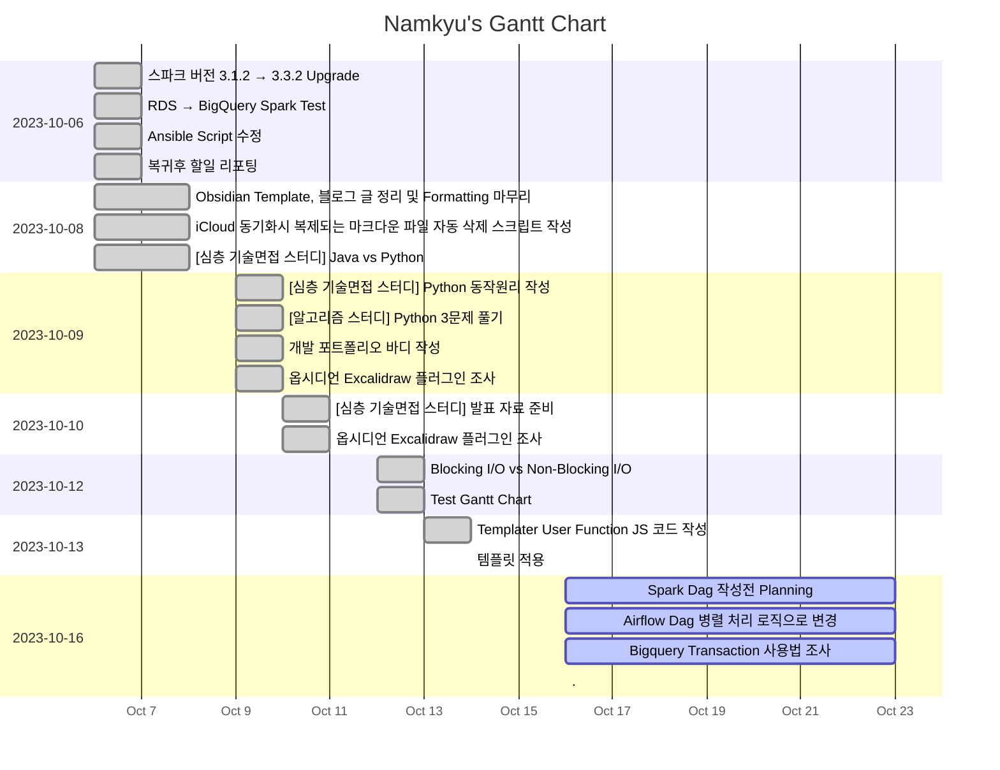

---
tags:
  - dailies
showDone: true
---
<< [[2023-10-15|Yesterday]] | [[2023-10-17|Tomorrow]] | [[2023-10-14|그저께]] | [[2023-10-18|모레]] >>

> [!warning]+ [[Action Dashboard| OverDue ]]
> ```tasks
> not done
> sort by due date
> due before 2023-10-16
> hide due date
> hide backlink
> limit 5
> ```

> [!todo]+ Today's Tasks
> ```tasks
> not done
> due 2023-10-16
> sort by path
> sort by priority
> hide due date
> hide backlink
> limit 5
> ```

> [!todo]+ Upcoming Tasks
> ```tasks  
> not done  
> due after 2023-10-16
> sort by due date
> sort by priority  



---

# To Do.

#### 오전
- [x] Spark Dag 작성전 Planning 🛫 2023-10-16 📅 2023-10-17 ✅ 2023-10-17


#### 오후
- [x] Airflow Dag 병렬 처리 로직으로 변경 🛫 2023-10-16 📅 2023-10-17 ✅ 2023-10-17
- [x] Bigquery Transaction 사용법 조사 🛫 2023-10-16 📅 2023-10-17 ✅ 2023-10-17


---


# 고민중
- 


---

# More Works To Be Done.

### Spark Dag 작성전 Planning
배경: 기존에 pymysql + airflow를 활용하여 db데이터를 bigquery