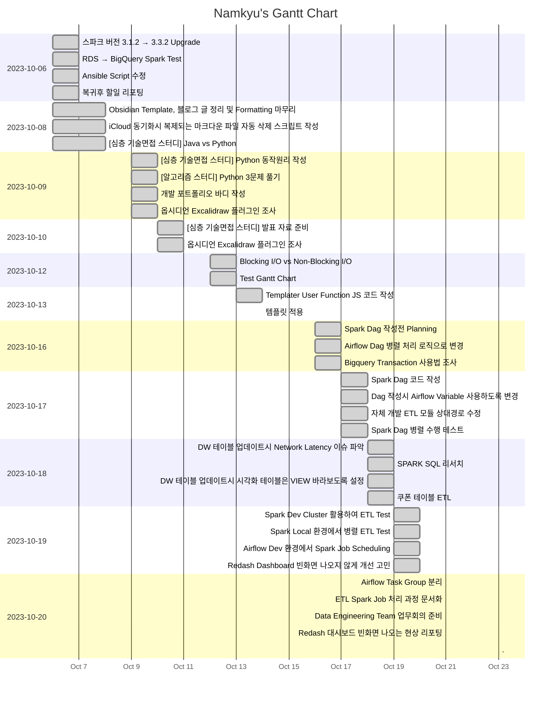

---
tags:
  - dailies
---
<< [[2023-10-22|Yesterday]] | [[2023-10-24|Tomorrow]] | [[2023-10-21|그저께]] | [[2023-10-25|모레]] >>

> [!warning]+ [[Action Dashboard| OverDue ]]
> ```tasks
> not done
> sort by due date
> due before 2023-10-23
> hide due date
> hide backlink
> limit 5
> ```

> [!todo]+ Today's Tasks
> ```tasks
> not done
> due 2023-10-23
> sort by path
> sort by priority
> hide due date
> hide backlink
> limit 5
> ```

> [!todo]+ Upcoming Tasks
> ```tasks  
> not done  
> due after 2023-10-23
> sort by due date
> sort by priority  



---

# To Do.

#### 오전
- [x] Airflow Task Group 분리 🛫 2023-10-20 📅 2023-10-21 ✅ 2023-10-21
- [x] ETL Spark Job 처리 과정 문서화 🛫 2023-10-20 📅 2023-10-21 ✅ 2023-10-21


#### 오후
- [x] Data Engineering Team 업무회의 준비  🛫 2023-10-20 📅 2023-10-21 ✅ 2023-10-21
- [x] Redash 대시보드 빈화면 나오는 현상 리포팅 🛫 2023-10-20 📅 2023-10-21 ✅ 2023-10-21


---


# 고민중

### 대시보드 아키텍처 수정


---

# More Works To Be Done.

