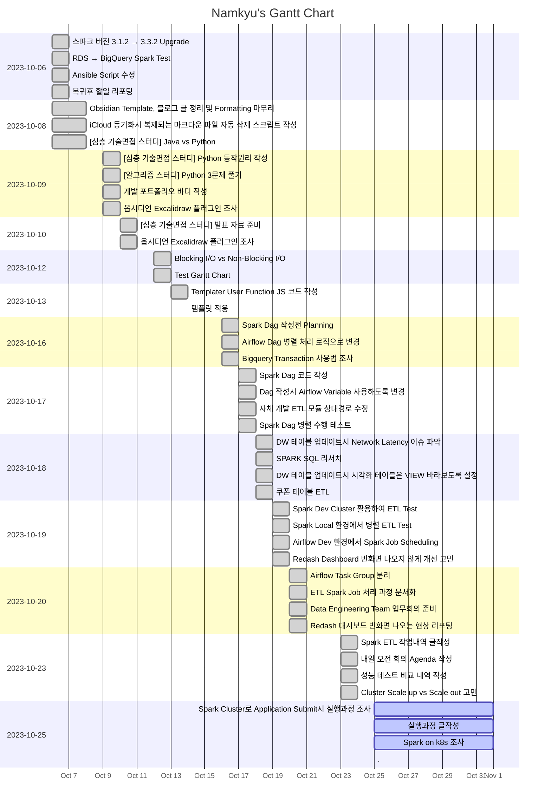

---
tags:
  - dailies
---
<< [[2023-10-24|Yesterday]] | [[2023-10-26|Tomorrow]] | [[2023-10-23|그저께]] | [[2023-10-27|모레]] >>

> [!warning]+ [[Action Dashboard| OverDue ]]
> ```tasks
> not done
> sort by due date
> due before 2023-10-25
> hide due date
> hide backlink
> limit 5
> ```

> [!todo]+ Today's Tasks
> ```tasks
> not done
> due 2023-10-25
> sort by path
> sort by priority
> hide due date
> hide backlink
> limit 5
> ```

> [!todo]+ Upcoming Tasks
> ```tasks  
> not done  
> due after 2023-10-25
> sort by due date
> sort by priority  



---

# To Do.

#### 오전
- [x] Spark Cluster로 Application Submit시 실행과정 조사 🛫 2023-10-25 📅 2023-10-26 ✅ 2023-10-26


#### 오후
- [x] 실행과정 글작성 🛫 2023-10-25 📅 2023-10-26 ✅ 2023-10-26
- [x] Spark on k8s 조사 🛫 2023-10-25 📅 2023-10-26 ✅ 2023-10-26


---


# 고민중
- 


---

# More Works To Be Done.

