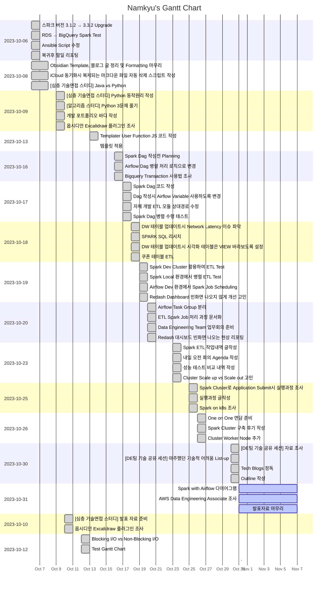

---
tags:
  - dailies
  - Template
---
<< [[2023-10-30|Yesterday]] | [[2023-11-01|Tomorrow]] | [[2023-10-29|그저께]] | [[2023-11-02|모레]] >>

> [!warning]+ [[Action Dashboard| OverDue ]]
> ```tasks
> not done
> sort by due date
> due before 2023-10-31
> hide due date
> hide backlink
> limit 5
> ```

> [!todo]+ Today's Tasks
> ```tasks
> not done
> due 2023-10-31
> sort by path
> sort by priority
> hide due date
> hide backlink
> limit 5
> ```

> [!todo]+ Upcoming Tasks
> ```tasks  
> not done  
> due after 2023-10-31
> sort by due date
> sort by priority  



---

# To Do.

#### 오전
- [ ] Spark with Airflow 다이어그램 🛫 2023-10-31 📅 2023-11-01
- [ ] AWS Data Engineering Associate 조사 🛫 2023-10-31 📅 2023-11-01


#### 오후
- [ ] 발표자료 마무리 🛫 2023-10-31 📅 2023-11-01


---

# 고민중
- 


---


# More Works To Be Done.

