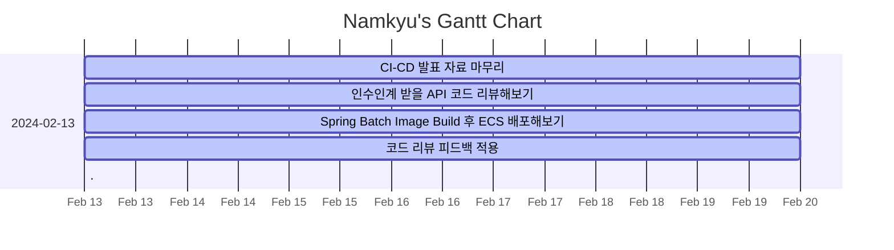

---
tags:
  - dailies
  - Template
---
<< [[2024-02-12|Yesterday]] | [[2024-02-14|Tomorrow]] | [[2024-02-11|그저께]] | [[2024-02-15|모레]] >>

> [!warning]+ [[Action Dashboard| OverDue ]]
> ```tasks
> not done
> sort by due date
> due before 2024-02-13
> hide due date
> hide backlink
> limit 5
> ```

> [!todo]+ Today's Tasks
> ```tasks
> not done
> due 2024-02-13
> sort by path
> sort by priority
> hide due date
> hide backlink
> limit 5
> ```

> [!todo]+ Upcoming Tasks
> ```tasks  
> not done  
> due after 2024-02-13
> sort by due date
> sort by priority  



---

# To Do.

#### 오전
- [x] CI-CD 발표 자료 마무리 🛫 2024-02-13 📅 2024-02-14 ✅ 2024-02-15
- [x] 인수인계 받을 API 코드 리뷰해보기 🛫 2024-02-13 📅 2024-02-14 ✅ 2024-02-15


#### 오후
- [x] Spring Batch Image Build 후 ECS 배포해보기 🛫 2024-02-13 📅 2024-02-14 ✅ 2024-02-16
- [x] 코드 리뷰 피드백 적용 🛫 2024-02-13 📅 2024-02-14 ✅ 2024-02-16


---

# 고민중
- 


---


# More Works To Be Done.

