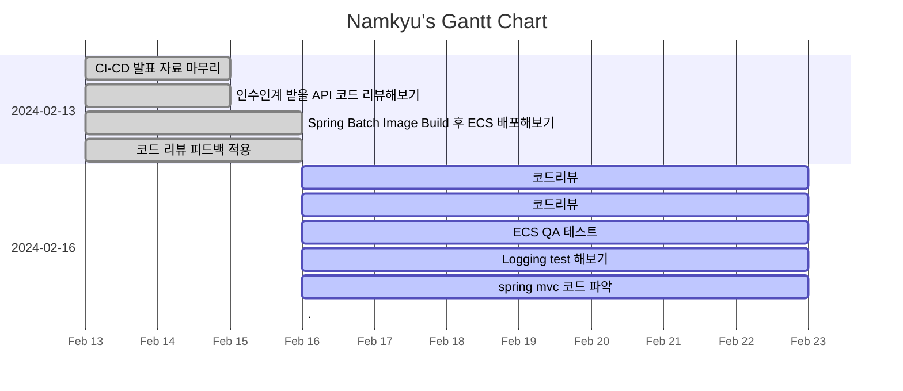

---
tags:
  - dailies
  - Template
---
<< [[2024-02-15|Yesterday]] | [[2024-02-17|Tomorrow]] | [[2024-02-14|그저께]] | [[2024-02-18|모레]] >>

> [!warning]+ [[Action Dashboard| OverDue ]]
> ```tasks
> not done
> sort by due date
> due before 2024-02-16
> hide due date
> hide backlink
> limit 5
> ```

> [!todo]+ Today's Tasks
> ```tasks
> not done
> due 2024-02-17
> sort by path
> sort by priority
> hide due date
> hide backlink
> limit 5
> ```

> [!todo]+ Upcoming Tasks
> ```tasks  
> not done  
> due after 2024-02-16
> sort by due date
> sort by priority  



---

# To Do.

#### 오전
- [x] 코드리뷰 🛫 2024-02-16 📅 2024-02-17 ✅ 2024-02-19
#### 점심시간
- 잠자기 O
- 책읽기 :<sup></sup> 
- 집안일 :

#### 오후
- [x] 코드리뷰 🛫 2024-02-16 📅 2024-02-17 ✅ 2024-02-19
- [x] ECS QA 테스트 🛫 2024-02-16 📅 2024-02-17 ✅ 2024-02-19
- [x] Logging test 해보기 🛫 2024-02-16 📅 2024-02-17 ✅ 2024-02-19
- [x] spring mvc 코드 파악 🛫 2024-02-16 📅 2024-02-17 ✅ 2024-02-19


---

# 고민중


---


# More Works To Be Done.

