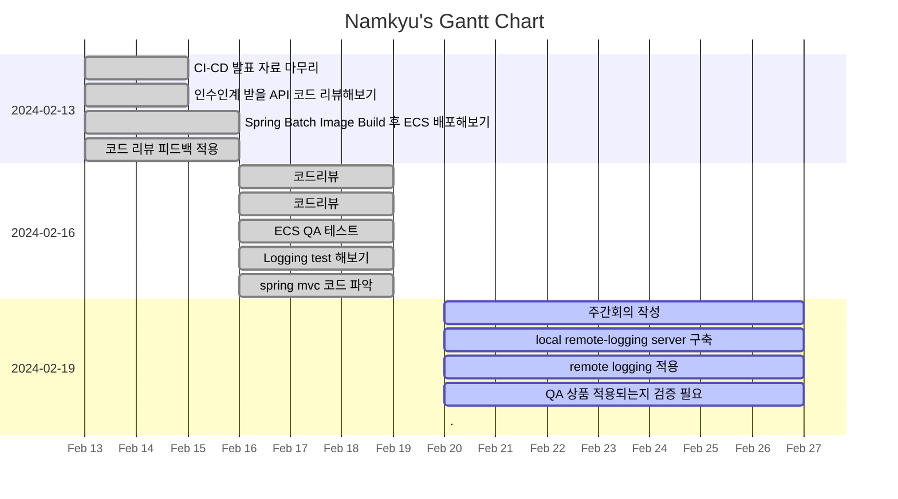

---
tags:
  - dailies
  - Template
---
<< [[2024-02-19|Yesterday]] | [[2024-02-21|Tomorrow]] | [[2024-02-18|그저께]] | [[2024-02-22|모레]] >>

> [!warning]+ [[Action Dashboard| OverDue ]]
> ```tasks
> not done
> sort by due date
> due before 2024-02-20
> hide due date
> hide backlink
> limit 5
> ```

> [!todo]+ Today's Tasks
> ```tasks
> not done
> due 2024-02-21
> sort by path
> sort by priority
> hide due date
> hide backlink
> limit 5
> ```

> [!todo]+ Upcoming Tasks
> ```tasks  
> not done  
> due after 2024-02-20
> sort by due date
> sort by priority  



---

# To Do.

#### 오전
- [x] 주간회의 작성 🛫 2024-02-20 📅 2024-02-21 ✅ 2024-02-20
- [x] local remote-logging server 구축 🛫 2024-02-20 📅 2024-02-21 ✅ 2024-02-20

#### 점심시간
- 잠자기 
- 책읽기 : ✅
- 집안일 :

#### 오후
- [x] remote logging 적용 🛫 2024-02-20 📅 2024-02-21 ✅ 2024-02-20
- [x] QA 상품 적용되는지 검증 필요 🛫 2024-02-20 📅 2024-02-21 ✅ 2024-02-20


---

# 고민중
- ES QA에서 색인 검증필요
- Serving API ECS endpoint 별로 검증 필요
- 도메인 내부용 외부용 분리
	- 서비스 외부에서 접속안되게 해야함


---


# More Works To Be Done.

