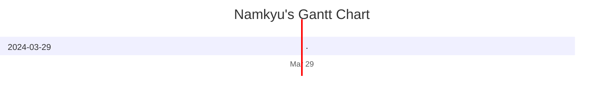

---
tags:
  - dailies
  - Template
---
<< [[2024-03-28|Yesterday]] | [[2024-03-30|Tomorrow]] | [[2024-03-27|그저께]] | [[2024-03-31|모레]] >>

> [!warning]+ [[Action Dashboard| OverDue ]]
> ```tasks
> not done
> sort by due date
> due before 2024-03-29
> hide due date
> hide backlink
> limit 5
> ```

> [!todo]+ Today's Tasks
> ```tasks
> not done
> due 2024-03-30
> sort by path
> sort by priority
> hide due date
> hide backlink
> limit 5
> ```

> [!todo]+ Upcoming Tasks
> ```tasks  
> not done  
> due after 2024-03-29
> sort by due date
> sort by priority  



---

# To Do.

#### 오전
- [x] 🛫 elastic search ttl 적용 2024-03-29 📅 2024-03-30 ✅ 2024-03-29
- [x] 🛫 Spring batch research 2024-03-29 📅 2024-03-30 ✅ 2024-03-29


#### 오후
- [x] 🛫 Springboot 3 조사 2024-03-29 📅 2024-03-30 ✅ 2024-03-29
- [x] 🛫 blog 글 1개쓰기 2024-03-29 📅 2024-03-30 ✅ 2024-03-29
- [x] 🛫 OS 스터디 글 4개 추가 2024-03-29 📅 2024-03-30 ✅ 2024-03-29

---

# 고민중
- 


---


# More Works To Be Done.

