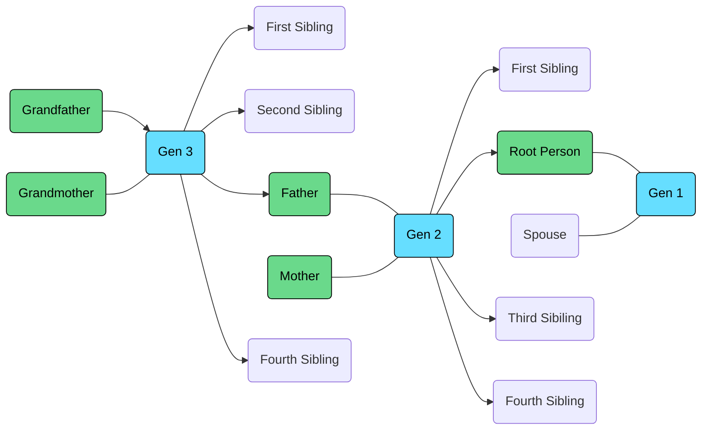

[https://www.mermaidflow.app/](https://www.mermaidflow.app/)

```mermaid
flowchart LR

%% Colors %%

classDef blue fill:#66deff,stroke:#000,color:#000
classDef green fill:#6ad98b,stroke:#000,color:#000

%% GENERATION 4 %%
Fa1(Grandfather):::green --> G3(Gen 3):::blue
Mo1(Grandmother):::green --- G3

%% GENERATION 3 %%	
G3 --> U1(First Sibling)
G3 --> U2(Second Sibling)

G3 --> Fa(Father):::green --- G2(Gen 2):::blue
Mo(Mother):::green --- G2

G3 --> U4(Fourth Sibling)

%% GENERATION 2 %%
G2 --> S1(First Sibling)
G2 --> Or(Root Person):::green

Or --- G1(Gen 1):::blue
Sp(Spouse) --- G1

G2 --> S3(Third Sibiling)
G2 --> S4(Fourth Sibling)
```

