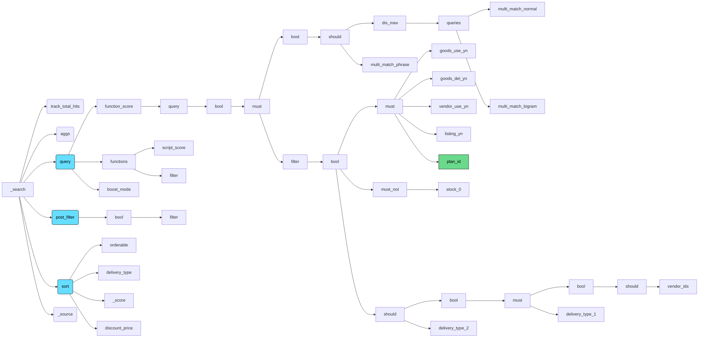
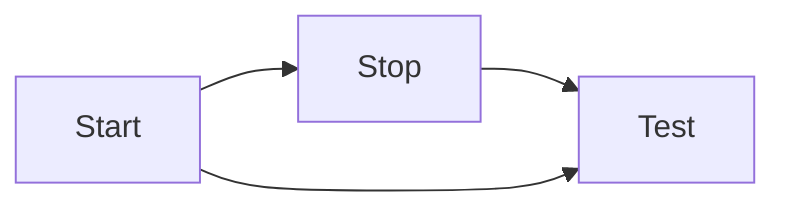

![[Spark Client Mode.png]]
![[Spark Local Mode.png]]

![[Standalone vs Mesos.png]]
![[Spark Deployment Modes.png]]
![[Pasted Image 20230809112634_406.png]]
![[Spark Cluster Mode2.png]]


2023-10-13


## hello

Dd

Dd
$$ x + y =z $$




```dataview
TABLE file.name, file.ctime as "created", file.path as "path"
FROM #Python 
```

```python
a = 1
b = 3

print(a+b)
```


```dataview
list
where contains(complete, false)
```


```dataview
table filter(file.tags, (t) => t !="#CodingTest" AND t !="#Learned") as tags
from #Learned 
```


```dataview
table platform, difficulty, filter(file.tags, (t) => t !="#CodingTest" AND t !="#Learned") as tags
from #CodingTest 
where file.name != "Coding Problem" AND file.name != "Baekjoon Skeleton Codes"
AND status = "Solved ✅"
```




---


```python
def hello(name):
	print("hello", name)

def add(a, b):
	return a+b

hello("kim")
print(add(1,2))
```

---


```python
hello("john")
```


---


```python
print(add(1,2))
print(add(1,2))
```


---


```python
print(add(1,2))
```

---


## This is Jupyter notebooks

다 할수있어

```
오늘 할것
```

```python

```

---
